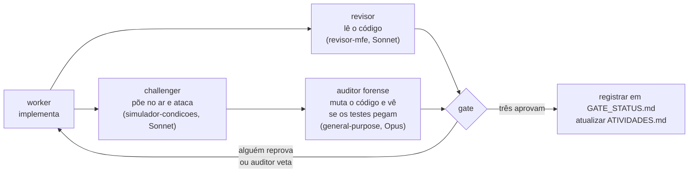

# Orquestrador — leia primeiro

Esta pasta guarda o estado do trabalho na base MFE, para qualquer pessoa ou agente retomar sem
depender de conversa anterior. Leia nesta ordem:

| # | Arquivo | Para quê | Quando atualizar |
|---|---|---|---|
| 1 | [`RETOMADA.md`](RETOMADA.md) | onde o trabalho está e o próximo passo; curto | a cada passo concluído |
| 2 | [`AMBIENTE.md`](AMBIENTE.md) | armadilhas do ambiente: Verdaccio, lockfile, submódulos, testes, commits | quando uma armadilha nova custar tempo |
| 3 | [`ATIVIDADES.md`](ATIVIDADES.md) | estado de cada atividade do GitLab e textos prontos | ao fim de todo gate, task ou decisão |
| 4 | [`GATE_STATUS.md`](GATE_STATUS.md) | veredito de cada rodada de gate, com o handoff de cada verificador | ao fechar um gate |
| 5 | [`DEFERRED.md`](DEFERRED.md) | o que foi adiado de propósito, com evidência | ao adiar ou resolver um item |
| 6 | [`MANUTENCAO-GITLAB.md`](MANUTENCAO-GITLAB.md) | regras de quando e como avisar sobre o GitLab | raramente |
| — | [`PROPOSTA-REORGANIZACAO.md`](PROPOSTA-REORGANIZACAO.md) | proposta de reorganização de docs e código, aguardando decisão | ao decidir; depois vai para `historico/` |

`.agents/arquivo/` guarda as pastas dos verificadores de gates encerrados (M1, M2, final, base) e
o pedido original da geração 1; na raiz de `.agents/` ficam só o orquestrador e o gate em andamento.

`historico/` guarda o que não vale mais como estado: a retomada de 2026-09-11 a 2026-09-21 e os
arquivos da geração 1 do harness (que citam `/home/gabrigas/...` e a PoC já removida).

## Como um gate funciona

- Cada verificador escreve `.agents/<nome>/handoff.md`. Nome: `<papel>_<gate>_<n>`.
- Verificador que já entregou handoff não é reusado; a rodada seguinte usa agentes novos.
- O auditor tem **veto**: uma correção cujo teste não reprova quando o código é revertido não conta.
- Só o challenger usa as portas; o auditor espera por elas.

## Onde fica o resto

- Código: `repos/` (um submódulo por repositório). Como rodar: `README.md` da raiz.
- Arquitetura: `docs/README.md` é o índice.
