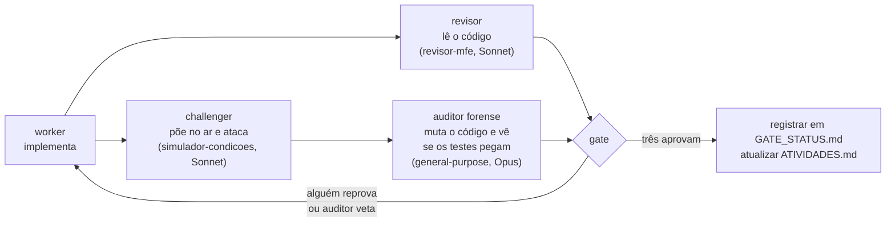

# Orquestrador — leia primeiro

Esta pasta guarda o estado do trabalho na base MFE, para qualquer pessoa ou agente retomar sem
depender de conversa anterior. Leia nesta ordem:

| # | Arquivo | Para quê | Quando atualizar |
|---|---|---|---|
| 1 | [`RETOMADA.md`](RETOMADA.md) | onde o trabalho está e o próximo passo; curto | a cada passo concluído |
| 2 | [`AMBIENTE.md`](AMBIENTE.md) | armadilhas do ambiente: Verdaccio, lockfile, submódulos, testes, commits | quando uma armadilha nova custar tempo |
| 3 | [`ATIVIDADES.md`](ATIVIDADES.md) | estado de cada atividade do GitLab e textos prontos | ao fim de todo gate, task ou decisão |
| 4 | [`GATE_STATUS.md`](GATE_STATUS.md) | veredito de cada rodada de gate, com o handoff de cada verificador | ao fechar um gate |
| 5 | [`DEFERRED.md`](DEFERRED.md) | o que foi adiado de propósito, com evidência | ao adiar ou resolver um item |
| 6 | [`MANUTENCAO-GITLAB.md`](MANUTENCAO-GITLAB.md) | regras de quando e como avisar sobre o GitLab | raramente |
| 7 | [`ledger/`](ledger/) | cópia do ledger SDD de cada plano (estado de cada task, achados adiados) | `task orquestrador:ledger` ao fechar task |
| 8 | [`CODEX.md`](CODEX.md) | handoff para agente sem subagentes do Claude Code (Codex): equivalências do processo e primeiros passos | ao trocar de ferramenta ou mudar o processo |

Na raiz de `.agents/` ficam só o orquestrador e as pastas dos verificadores do gate em andamento
(e do anterior, enquanto o atual cita os achados dele). **Gate fechado: as pastas saem com `git rm`**;
o que já saiu está na tag `historico-2026-09-22`.

**Regras de processo (pedido do humano, 2026-09-22):** estado salvo e commitado a cada passo;
handoff completo aos 80% do uso da sessão do horário; `ATIVIDADES.md` revisado a cada passo; só o
necessário no repositório. Detalhes no fim de `RETOMADA.md`.

**Regras de processo (humano, 2026-10-05):**
- **Toda revisão com agente, de task ou de gate, escreve o rascunho desde o começo.** O revisor de task cria
  `.superpowers/sdd/<plano>/review-task<N>-achados.md` com "(parcial)" antes de ler o diff e o atualiza a cada
  parte revisada; no fim, "(final)" com o veredito. A primeira revisão da Task 6 do D2 morreu no limite de sessão
  sem deixar nada.
- **O ledger SDD vai para o git ao fechar cada task e antes de parar:** `task orquestrador:ledger` copia
  `progress.md` e os `*-achados.md` (sem diffs, briefs nem relatórios) para `ledger/<plano>/` nesta pasta; o
  commit vem junto com o do `RETOMADA.md`. `.superpowers/sdd/` continua fora do git (o `.gitignore` de lá é da
  ferramenta).

**Regras de processo (humano, 2026-10-06):**
- **Critério de pronto do objetivo:** as funcionalidades básicas listadas em `RETOMADA.md` ("Objetivo final"). Sessão
  compartilhada e cache não são básicas; C2, B2, G4 e G5 ficam para depois do objetivo.
- **Veto só por teste → iteração seguinte só com um auditor novo** (detalhe em "Como um gate funciona").
- **Verificador interrompido pelo limite não é retomado em outra sessão:** despacha-se um novo com as etapas que faltam.

**Regra de processo (humano, 2026-10-07):**
- **Mutações declaradas no plano.** Toda task que muda código de produto traz no plano a tabela das mutações que os testes dela precisam pegar. O worker roda essas mutações antes de pedir o gate e registra, no relatório da task, qual teste pegou cada uma; mutação que sobrevive pede um teste novo na mesma task. O auditor do gate reaplica a tabela e procura mutações novas. Primeiro uso: o plano do núcleo 0.10.4, cujo gate fechou na iteração 1 (o do C1 levou 3).

**Práticas do orquestrador (gate do E3, E4 e E5, 2026-10-07; não são regras do humano):**
- **Verificação final completa antes do challenger.** O orquestrador roda todas as famílias (`task test`, estática, scripts,
  `verificar:redis`, `verificar:oidc`, `showcase:verificar` nos dois modos) antes de despachar o challenger: a rodada achou
  uma regressão (suíte do showcase no glob da base) que o revisor por leitura não viu.
- **Revisor por leitura em paralelo; challenger e auditor depois das portas.** O revisor não usa portas e pode rodar junto
  com a verificação final.
- **Veto só por teste pequeno: o orquestrador pode corrigir** (um teste, poucas linhas), provando a mutação do veto contra o
  teste novo e revertendo, e registra no `GATE_STATUS.md` quem corrigiu. Correção maior vai a um worker.
- **Auditor da iteração N recebe a lista do que os anteriores já mutaram e classificaram** (os `mutacoes.txt`), com a
  instrução de não repetir nem reclassificar sem fato novo, e de ser proporcional ao que o roteiro ou o comando prometem.
  Nesse gate isso levou o quinto auditor ao PASS.
- **Em aberto com o humano:** um teto de iterações por veto só por teste para ferramentas do showcase (o gate do E3-E5
  levou 6). Pergunta Q4 de `pedidos/2026-10-07-proximo-passo.md`.

## Como um gate funciona

```mermaid
flowchart LR
    W["worker<br/>implementa"] --> R["revisor<br/>lê o código<br/>(revisor-mfe, Sonnet)"]
    W --> C["challenger<br/>põe no ar e ataca<br/>(simulador-condicoes, Sonnet)"]
    C --> A["auditor forense<br/>muta o código e vê<br/>se os testes pegam<br/>(general-purpose, Opus)"]
    R & A --> G{"gate"}
    G -- "três aprovam" --> OK["registrar em GATE_STATUS.md<br/>atualizar ATIVIDADES.md"]
    G -- "alguém reprova<br/>ou auditor veta" --> W
```

- Cada verificador escreve `.agents/<nome>/handoff.md`. Nome: `<papel>_<gate>_<n>`.
- **O handoff é escrito desde o começo e atualizado a cada etapa concluída**, com a marca
  "(parcial)" até o fim. Duas rodadas morreram no limite de sessão sem deixar nada; com o
  rascunho, a próxima retoma de onde parou.
- Mutações rodam com `CONSTRUIR=1`, que reconstrói só as apps com fonte mais novo que o build
  (`precisaConstruir` em `base/scripts/ambiente.mjs`); `CONSTRUIR=tudo` força todas.
- Verificador que já entregou handoff não é reusado; a rodada seguinte usa agentes novos.
- O auditor tem **veto**: uma correção cujo teste não reprova quando o código é revertido não conta.
- **Veto só por teste** (sem defeito de produto; a correção muda só `test/`) — regra do humano, 2026-10-06: a iteração
  seguinte roda **só um auditor novo**, sem revisor nem challenger. Ele reaplica as mutações do veto, prova que os testes
  novos as pegam e repete a regressão por família. Se a correção tocar código de produto, a iteração seguinte é completa.
- Só o challenger usa as portas; o auditor espera por elas.
- Se o orquestrador trabalhar em outro submódulo durante um gate, **registra no `RETOMADA.md` e avisa os
  verificadores no despacho**: o challenger_shell_3 viu mudanças no núcleo e na moldura e as tomou
  por um processo concorrente.

## Onde fica o resto

- Código: `repos/` (um submódulo por repositório). Como rodar: `README.md` da raiz.
- Arquitetura: `docs/README.md` é o índice.
