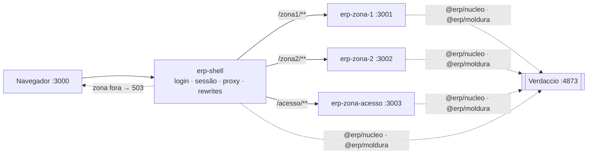

# nextjs-mfe — base BFF + Multi-Zones com Next.js

Base genérica de micro-frontends com **Next.js Multi-Zones** (Next 16, App Router): um shell, duas
zonas de negócio e uma zona de gestão de acesso, cada uma um processo e um repositório próprio,
sem código de domínio no núcleo. Decisões no
[ADR-0009](docs/adr/0009-base-generica.md) e no
[ADR-0010](docs/adr/0010-reconciliacao-do-nucleo.md).

| Parte | Onde | Porta | Papel |
|---|---|---|---|
| Shell | `repos/erp-shell` | 3000 | login, único escritor da sessão, rewrites das zonas (`zonas.json`), 503 de zona fora, gateway de telemetria, domínio próprio (avisos) |
| Zona 1 | `repos/erp-zona-1` | 3001 | domínios A e B; módulo livre `/zona1` e restrito `/zona1/relatorios` |
| Zona 2 | `repos/erp-zona-2` | 3002 | domínio C; Server Action com `If-Match` que leva o toast para a zona 1 |
| Zona de acesso | `repos/erp-zona-acesso` | 3003 | perfil × módulo, restrição e usuário × perfil |
| Pacotes | `repos/erp-{contratos,nucleo,moldura}` | — | publicados no Verdaccio local `:4873` |
| Domínios falsos | `repos/erp-dominio-stub` | 4001–4004, 4010 | A, B, C, plataforma e gestão de acesso |
| Ferramentas da base | `base/` | — | subir tudo (`scripts/`), verificação ponta a ponta (`verificacao/`), Verdaccio (`docker-compose.yml`) |



Diagramas completos em [`docs/arquitetura/atual.md`](docs/arquitetura/atual.md); o que falta
para a arquitetura final em [`docs/arquitetura/alvo.md`](docs/arquitetura/alvo.md) §6.

## 1. Requisitos

- Node **24** e pnpm **11 ou mais novo**. Os testes usam o runner nativo e a remoção de tipos do
  Node; não há `tsx` nem `jest`.
- Docker, para o Verdaccio.
- Portas 3000–3003, 4001–4004, 4010 e 4873 livres.

## 2. Instalar e rodar

**Todo comando da base passa pelo [Taskfile](Taskfile.yml)** ([Task](https://taskfile.dev) 3.x).
`task` sozinho lista as tarefas com a descrição de cada uma.

```bash
git clone --recurse-submodules <url> && cd nextjs-mfe
task preparar      # máquina nova: submódulos, hooks, Verdaccio, publicação dos pacotes, instalação
task base          # sobe tudo em http://localhost:3000 (Ctrl-C derruba)
```

**Showcase** (ver tudo funcionando, com as zonas rodando):

```bash
task showcase            # Redis + Keycloak + domínios com dados gravados + shell e 3 zonas; Ctrl-C derruba
task showcase:conferir   # noutro terminal: o que cada ator vê em cada zona, infraestrutura e segurança visível
```

Depois abra http://localhost:3000 e siga [`docs/ROTEIRO-DE-VERIFICACAO.md`](docs/ROTEIRO-DE-VERIFICACAO.md).

`task preparar` publica os pacotes; num Verdaccio que já os tem, rode só `task instalar`.

Entre como `ana`, `bruno`, `carla` ou `davi`: cada um vê um menu diferente. Use `localhost`, não
`127.0.0.1`, porque o cookie `__Host-session` exige origem segura.

> **Lockfiles e Verdaccio.** Cada máquina tem o próprio Verdaccio. `npm pack` não é reproduzível
> byte a byte, então um pacote republicado noutra máquina tem outro hash, e o `pnpm install`
> recusa o lockfile (`ERR_PNPM_TARBALL_INTEGRITY`). Publique versão nova quando mudar um pacote,
> nunca o mesmo número duas vezes (ADR-0010). O que fazer quando um lockfile falhar:
> [`.agents/orchestrator/AMBIENTE.md`](.agents/orchestrator/AMBIENTE.md) §1.

## 3. Como testar

| Suíte | Comando | Testes | Protege |
|---|---|---|---|
| `erp-contratos` | `pnpm test` | 15 | manifesto: prefixo de zona, concessão entre zonas, duplicatas |
| `erp-nucleo` | `pnpm test` | 107 | registro de destinos, sessão leitor/escritor (arquivo e Redis), fragmentos entre zonas, acesso, fronteira entre camadas, exports |
| `erp-moldura` | `pnpm test` | 25 | menu e `aria-current`, host de toast, flash, `FormularioDeAcao` |
| `erp-dominio-stub` | `pnpm test` | 24 | projeção e escopo dos domínios, `If-Match`, regras da gestão de acesso, dados em JSON e persistência |
| `erp-shell` | `pnpm test` | 36 | decisão do proxy, sonda de saúde das zonas, mapa de zonas, gateway de telemetria |
| ponta a ponta | `task verificar` | 50 | N3–N8 pelo shell com os quatro atores; toda Server Action pelo caminho do navegador; toast uma vez só; domínios e uma zona derrubados; zona travada vira 503 em < 2 s; nonce novo a cada requisição; gestão de acesso fora sem vazamento em nenhuma página de módulo |

`task test` roda as unidades dos 8 repositórios. `task verificar` sobe domínios, shell e zonas, verifica
e derruba tudo. Depois de mudar código de uma app, use `task verificar:construir` para refazer os builds. Rodando uma suíte à mão, use sempre
o glob explícito (`node --test test/*.test.mjs`): no Node 24.7, `node --test <pasta>` roda zero
testes e sai com 0.

### Testes com navegador real

Alguns testes (L6: navegação do cliente do Next) precisam de um navegador baseado em Chromium.
**Nada é instalado pelo projeto**: a verificação usa o que a máquina já tem, nesta ordem:

| Onde | Como é achado |
|---|---|
| `ERP_CHROME=/caminho/do/binario` | tem precedência; qualquer Chrome, Chromium, Edge ou Brave |
| PATH | `google-chrome`, `chromium`, `microsoft-edge`, `brave-browser` e variantes |
| macOS e Windows | caminhos de instalação padrão do Chrome, Chromium e Edge |
| Flatpak | `com.google.Chrome` |
| Docker, **só se pedido** | `ERP_CHROME=docker` (Linux): baixa `chromedp/headless-shell` fixado por digest (~100 MB), remove o container no fim; `ERP_CHROME_DOCKER_LIMPAR=1` apaga também a imagem |

Sem nenhum deles, esses testes são **pulados** com a instrução acima, e o resto da verificação
roda normalmente. Cada execução usa um perfil temporário, apagado no fim.

A verificação manual, item a item, está em
[`docs/ROTEIRO-DE-VERIFICACAO.md`](docs/ROTEIRO-DE-VERIFICACAO.md).

## 4. Limitações conhecidas

- Login de desenvolvimento sem senha (`identidadeDev`) e store de sessão em arquivo. OIDC e Redis
  ficam para depois (`alvo.md` §6).
- Sem renovação de token: a sessão de desenvolvimento dura 30 minutos. O alvo é sessão de 30 min
  **por inatividade**, com renovação no shell (ADR-0013); os tempos são configuração
  ([`docs/CONFIGURACAO.md`](docs/CONFIGURACAO.md)).
- O 503 de zona fora e o gateway de telemetria do shell **ainda não passaram por gate** (iteração 4
  em andamento; ver `.agents/orchestrator/RETOMADA.md`).
- O showcase (`task showcase`) sobe tudo: Redis, Keycloak, domínios com dados gravados, shell e zonas.
  As apps ainda usam o login de desenvolvimento e a sessão em arquivo; ligá-las ao Keycloak e ao Redis
  é o próximo passo (D1, D2 em `.agents/orchestrator/RETOMADA.md`).
- Os domínios falsos leem os dados de `repos/erp-dominio-stub/dados/semente/*.json`. Na verificação
  e em `task base` rodam em memória: a gestão de acesso reiniciada perde manifestos e concessões, e
  `pnpm registrar` em cada app os recria. Com `DADOS_DIR` (showcase) o estado é gravado em arquivo.

## 5. Escalar: adicionar uma zona

1. **Repositório novo** `erp-<zona>` no modelo de `erp-zona-2`: `assetPrefix: '/<zona>-static'`,
   rotas sob `app/<zona>/`, `serverActions.allowedOrigins` com o host do shell, `lib/nucleo.ts`
   com os destinos que a zona pode chamar, e `<Moldura>` no layout.
2. **Manifesto** `acesso.manifesto.ts`: módulos, perfis e concessões com o prefixo da zona.
   Registre com `pnpm registrar`.
3. **Shell**: acrescente `"<zona>": "<origem>"` em `repos/erp-shell/zonas.json`. Rewrites, sonda de
   saúde e 503 saem desse mapa.
4. **Submódulo e verificação**: registre o repositório em `.gitmodules` e inclua a app em
   `base/scripts/ambiente.mjs` e nas listas de `base/verificacao/base.test.mjs`.

O desenho completo (mapa de zonas, contrato de fragmento, sessão, deploy) está em
`docs/desenho/mfe/`; o checklist organizacional em `02-zonas.md` §4.

## 6. Documentação

| Para | Comece em |
|---|---|
| entender a arquitetura, o que falta e como conferir | [`docs/README.md`](docs/README.md) |
| saber que variável controla cada tempo e limite | [`docs/CONFIGURACAO.md`](docs/CONFIGURACAO.md) |
| retomar o trabalho em andamento (estado, gates, GitLab, armadilhas do ambiente) | [`.agents/orchestrator/LEIA-PRIMEIRO.md`](.agents/orchestrator/LEIA-PRIMEIRO.md) |
| pedidos de pesquisa aguardando resposta | [`pedidos/`](pedidos/) |

## 7. Histórico

A PoC anterior (`apps/host`, `apps/remote-app`, `packages/shell-ui`, com Module Federation e
depois Multi-Zones em Next 14) foi removida em 2026-09-21. Ela está preservada na tag
**`poc-final`** (`git checkout poc-final`), junto com a documentação dela
(`docs/arquitetura/poc-congelada.md`, `docs/testes-navegador.md`).
