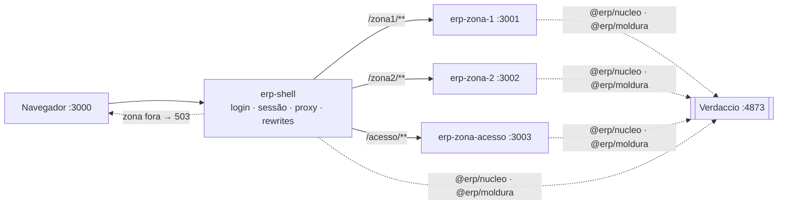

# nextjs-mfe — base BFF + Multi-Zones com Next.js

Base genérica de micro-frontends com **Next.js Multi-Zones** (Next 16, App Router): um shell, duas
zonas de negócio e uma zona de gestão de acesso, cada uma um processo e um repositório próprio,
sem código de domínio no núcleo. Decisões no
[ADR-0009](docs/design-bff/comum/docs/adr/0009-base-generica.md) e no
[ADR-0010](docs/design-bff/comum/docs/adr/0010-reconciliacao-do-nucleo.md).

| Parte | Onde | Porta | Papel |
|---|---|---|---|
| Shell | `repos/erp-shell` | 3000 | login, único escritor da sessão, rewrites das zonas (`zonas.json`), 503 de zona fora, gateway de telemetria, domínio próprio (avisos) |
| Zona 1 | `repos/erp-zona-1` | 3001 | domínios A e B; módulo livre `/zona1` e restrito `/zona1/relatorios` |
| Zona 2 | `repos/erp-zona-2` | 3002 | domínio C; Server Action com `If-Match` que leva o toast para a zona 1 |
| Zona de acesso | `repos/erp-zona-acesso` | 3003 | perfil × módulo, restrição e usuário × perfil |
| Pacotes | `repos/erp-{contratos,nucleo,moldura}` | — | publicados no Verdaccio local `:4873` |
| Domínios falsos | `repos/erp-dominio-stub` | 4001–4004, 4010 | A, B, C, plataforma e gestão de acesso |



Diagramas completos em [`docs/arquitetura/atual.md`](docs/arquitetura/atual.md); o que falta
para a arquitetura final em [`docs/arquitetura/alvo.md`](docs/arquitetura/alvo.md) §6.

## 1. Requisitos

- Node **24** e pnpm **11 ou mais novo**. Os testes usam o runner nativo e a remoção de tipos do
  Node; não há `tsx` nem `jest`.
- Docker, para o Verdaccio.
- Portas 3000–3003, 4001–4004, 4010 e 4873 livres.

## 2. Instalar e rodar

```bash
git clone --recurse-submodules <url> && cd nextjs-mfe   # ou: git submodule update --init
pnpm registry:up                                         # Verdaccio (docker compose)
# num Verdaccio novo o volume está vazio: publique os pacotes, nesta ordem
for d in repos/erp-{contratos,nucleo,moldura}; do (cd $d && pnpm install && pnpm publicar); done
for d in repos/erp-{shell,zona-1,zona-2,zona-acesso,dominio-stub}; do (cd $d && pnpm install); done
pnpm base                                                # sobe tudo em http://localhost:3000
```

Entre como `ana`, `bruno`, `carla` ou `davi`: cada um vê um menu diferente. Use `localhost`, não
`127.0.0.1`, porque o cookie `__Host-session` exige origem segura.

> **Lockfiles e Verdaccio.** Cada máquina tem o próprio Verdaccio. `npm pack` não é reproduzível
> byte a byte, então um pacote republicado noutra máquina tem outro hash, e o `pnpm install`
> recusa o lockfile (`ERR_PNPM_TARBALL_INTEGRITY`). Publique versão nova quando mudar um pacote,
> nunca o mesmo número duas vezes (ADR-0010).

## 3. Como testar

| Suíte | Comando | Testes | Protege |
|---|---|---|---|
| `erp-contratos` | `pnpm test` | 15 | manifesto: prefixo de zona, concessão entre zonas, duplicatas |
| `erp-nucleo` | `pnpm test` | 60 | registro de destinos, sessão leitor/escritor, acesso, fronteira entre camadas, exports |
| `erp-moldura` | `pnpm test` | 16 | menu e `aria-current`, host de toast, flash, `FormularioDeAcao` |
| `erp-dominio-stub` | `pnpm test` | 16 | projeção e escopo dos domínios, `If-Match`, regras da gestão de acesso |
| `erp-shell` | `pnpm test` | 22 | decisão do proxy, sonda de saúde das zonas, mapa de zonas, gateway de telemetria |
| ponta a ponta | `pnpm verificar` | 26 | N3–N8 pelo shell com os quatro atores; toda Server Action pelo caminho do navegador; toast uma vez só; domínios derrubados um a um |

`pnpm verificar` sobe domínios, shell e zonas, verifica e derruba tudo. Depois de mudar código de
uma app, use `pnpm verificar:construir` para refazer os builds. Rodando uma suíte à mão, use sempre
o glob explícito (`node --test test/*.test.mjs`): no Node 24.7, `node --test <pasta>` roda zero
testes e sai com 0.

A verificação manual, item a item, está em
[`docs/ROTEIRO-DE-VERIFICACAO.md`](docs/ROTEIRO-DE-VERIFICACAO.md).

## 4. Limitações conhecidas

- Login de desenvolvimento sem senha (`identidadeDev`) e store de sessão em arquivo. OIDC e Redis
  ficam para depois (`alvo.md` §6).
- Sem renovação de token: a sessão de desenvolvimento dura 30 minutos.
- O 503 de zona fora e o gateway de telemetria do shell **ainda não passaram por gate** (ver
  `.agents/orchestrator/RETOMADA.md`).
- O domínio falso de gestão de acesso guarda tudo em memória: reiniciado, perde manifestos e
  concessões. `pnpm registrar` em cada app os recria.

## 5. Escalar: adicionar uma zona

1. **Repositório novo** `erp-<zona>` no modelo de `erp-zona-2`: `assetPrefix: '/<zona>-static'`,
   rotas sob `app/<zona>/`, `serverActions.allowedOrigins` com o host do shell, `lib/nucleo.ts`
   com os destinos que a zona pode chamar, e `<Moldura>` no layout.
2. **Manifesto** `acesso.manifesto.ts`: módulos, perfis e concessões com o prefixo da zona.
   Registre com `pnpm registrar`.
3. **Shell**: acrescente `"<zona>": "<origem>"` em `repos/erp-shell/zonas.json`. Rewrites, sonda de
   saúde e 503 saem desse mapa.
4. **Submódulo e verificação**: registre o repositório em `.gitmodules` e inclua a app em
   `repos/scripts/ambiente.mjs` e nas listas de `repos/verificacao/base.test.mjs`.

O desenho completo (mapa de zonas, contrato de fragmento, sessão, deploy) está em
`docs/design-bff/mfe/`; o checklist organizacional em `02-zonas.md` §4.

## 6. Documentação

| Documento | Para quê |
|---|---|
| `docs/arquitetura/atual.md` | Base em `repos/` com diagramas: topologia, navegação, destinos, gestão de acesso, toast entre zonas, testes, falhas |
| `docs/arquitetura/alvo.md` | Arquitetura alvo com diagramas e a tabela do que falta |
| `docs/ROTEIRO-DE-VERIFICACAO.md` | Verificação manual da base |
| `docs/design-bff/` | Desenho completo e ADRs |
| `.agents/orchestrator/` | Estado do trabalho: `RETOMADA.md`, `GATE_STATUS.md` (vereditos), `DEFERRED.md`, `MANUTENCAO-GITLAB.md` |
| `pedidos/` | Pedidos de pesquisa aguardando resposta |

## 7. Histórico

A PoC anterior (`apps/host`, `apps/remote-app`, `packages/shell-ui`, com Module Federation e
depois Multi-Zones em Next 14) foi removida em 2026-09-21. Ela está preservada na tag
**`poc-final`** (`git checkout poc-final`), junto com a documentação dela
(`docs/arquitetura/poc-congelada.md`, `docs/testes-navegador.md`).
