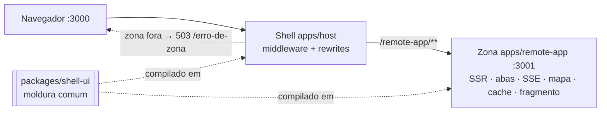

# nextjs-mfe — base Multi-Zones com Next.js

Prova de conceito de micro-frontends com **Next.js Multi-Zones nativo**: um shell (gateway) e
uma zona autônoma, cada um em seu próprio processo, conversando só por HTTP. Substituiu a
versão anterior com Module Federation (histórico em `WALKTHROUGH.md`).

| Parte | Onde | Porta | Papel |
|---|---|---|---|
| Shell | `apps/host` | 3000 | Página inicial, moldura, proxy das rotas da zona (`rewrites`), página de queda da zona |
| Zona | `apps/remote-app` | 3001 | `basePath: /remote-app`, `assetPrefix: /remote-app-static`, SSR, SSE, mapa, fragmento, health |
| Moldura compartilhada | `packages/shell-ui` | — | Header, navegação lateral, layout e toasts usados pelas duas apps (código-fonte, compilado em cada uma) |

O usuário acessa tudo por `http://localhost:3000`. `/remote-app/**` e `/remote-app-static/**`
são repassados à zona; se ela estiver fora, o shell responde 503 com a página `/erro-de-zona`.

| Quer… | Leia |
|---|---|
| entender como as peças se ligam hoje (com diagramas) | [`docs/arquitetura/atual.md`](docs/arquitetura/atual.md) |
| ver para onde a base vai e o que falta | [`docs/arquitetura/alvo.md`](docs/arquitetura/alvo.md) |
| conferir com as próprias mãos a integração e as funcionalidades | [`docs/ROTEIRO-DE-VERIFICACAO.md`](docs/ROTEIRO-DE-VERIFICACAO.md) |



### Funcionalidades base

| Funcionalidade | Onde ver | Estado |
|---|---|---|
| Zona dentro da moldura do shell (header + navegação) | `/remote-app` | ✅ |
| Server-Side Rendering | `/`, `/remote-app` | ✅ |
| Query params e rota de caminho | `/remote-app?tab=telemetry&filter=warn`, `/remote-app/mapa/tokyo` | ✅ |
| SSE | `/remote-app?tab=telemetry` | ⚠️ vazamento no servidor (D1) |
| Mapa MapLibre GL | `/remote-app?tab=map` | ✅ |
| Toast global | botão **Ping Toast** | ✅ |
| Sessão do shell herdada pela zona | seletor do header | ⚠️ só no cliente (D3) |
| Cache de servidor (5 s) e `Cache-Control` | `/remote-app/api/server-data` | ✅ |
| Queda isolada da zona | pare a zona | ✅ |
| Fragmento HTML inerte (200/204/405) | `/remote-app/_fragmento/demo/42` | ✅ |

## 1. Requisitos

- Node **24** (testado em 24.7.0). Os testes usam o runner nativo e a remoção de tipos do Node;
  não há `tsx`/`jest`.
- pnpm **11** (testado em 11.22.0).
- Portas 3000 e 3001 livres.

## 2. Instalar e rodar

```bash
pnpm install

# desenvolvimento (as duas apps, com recarga)
pnpm dev

# produção local
pnpm build
pnpm start
```

Abra `http://localhost:3000` e siga o link **Remote App** na navegação lateral. A troca de zona
é uma navegação de documento inteira (link `<a>` comum), por desenho.

Variável opcional do shell: `REMOTE_ZONE_URL` (ou `REMOTE_APP_URL`), origem da zona;
padrão `http://localhost:3001`. Os rewrites e a sonda de vivacidade usam o mesmo valor.

---

## 3. Como testar

Três camadas, da mais rápida para a mais completa. As duas primeiras não precisam de servidor.

### 3.1 Checagem rápida (sem servidores) — rode antes de todo commit

```bash
pnpm check
```

Equivale a `pnpm typecheck && pnpm test && node scripts/smoke-test.mjs --offline`:

| Etapa | O que verifica |
|---|---|
| `pnpm typecheck` | `tsc --noEmit` em `packages/shell-ui`, `apps/remote-app` e `apps/host` |
| `pnpm test` | suítes unitárias das três partes (abaixo) |
| `smoke-test --offline` | invariantes estáticos STATIC-01..07: nada de Module Federation, `<a>` entre zonas, shell sem DAL, rewrites e `basePath` corretos |

Para rodar uma suíte só, entre na pasta e use **sempre o glob explícito**
(no Node 24.7, `node --test <pasta>` roda zero testes e sai com 0):

```bash
cd apps/host && node --test test/*.test.ts
```

O que cada suíte cobre:

| Suíte | Testes | Cobre |
|---|---|---|
| `packages/shell-ui/test` | 15 | Moldura renderizada com `react-dom/server`: header, seletor de sessão, botão de toast, links `<a>` e link ativo, layout com `children` e portal de toasts; handlers chamados de verdade; imports só de `react`; CSS de toda classe renderizada |
| `apps/remote-app/test` | 36 | Health, contrato do fragmento (200 inerte / 204 / 405), `next.config`, página dentro da moldura, abas por query, rota `/mapa/[cidade]`, caminho do SSE no `basePath`, espelho de sessão, emissão de toast |
| `apps/host/test` | 47 | Middleware real contra zona simulada (503 com `Retry-After`, TTL de 1 s, recuperação, timeout da sonda, caminhos que o rewrite repassa, não lê a requisição), rewrites, `/erro-de-zona` sem rede, página inicial na moldura, emissão de toast |

### 3.2 Smoke com as apps no ar

Em um terminal: `pnpm build && pnpm start`. Em outro:

```bash
pnpm smoke            # = node scripts/smoke-test.mjs --strict
```

Esperado: `Total tests: 17, Passed: 17`. Além dos estáticos, ONLINE-01..10 checam a página do
shell, a zona pelo shell e direto, health, fragmento, assets pela `/remote-app-static` e que
`/REMOTE-APP` (maiúsculas) fica no shell.

`HOST_URL` e `ZONE_URL` mudam os alvos. Detalhe de cada checagem em `TEST_READY.md`.

### 3.3 Verificação manual

O que depende de JavaScript no navegador (SSE chegando, mapa, toast, sessão entre páginas) não
tem teste automático. O passo a passo, com o resultado esperado de cada item, está em
[`docs/ROTEIRO-DE-VERIFICACAO.md`](docs/ROTEIRO-DE-VERIFICACAO.md). O mínimo:

```bash
# zona no ar
curl -s http://localhost:3000/remote-app/mapa/tokyo | grep -o 'Tokyo Datacenter' | head -1
curl -sN --max-time 4 http://localhost:3000/remote-app/api/sse-events | head -3

# zona fora (pnpm start:host sozinho)
curl -si http://localhost:3000/remote-app | head -1      # HTTP/1.1 503 Service Unavailable
curl -si http://localhost:3000/ | head -1                # HTTP/1.1 200 OK
```

---

## 4. Limitações conhecidas

Registradas com evidência em `.agents/orchestrator/DEFERRED.md`. As que afetam quem usa a base:

- **Sessão entre zonas (D3):** não há cookie nem store de sessão. A zona espelha o usuário
  escolhido via `localStorage` depois de carregar; o HTML do servidor sempre mostra o usuário
  padrão. Um valor malformado nessa chave pode quebrar a página (D11).
- **Janela após a queda (§5.1 de `docs/design-bff/mfe/01-operacao.md`):** por até ~1 s depois que a
  zona cai, requisições ainda recebem o 500 cru do Next. Zona travada (processo vivo, sem resposta)
  segura requisições por até 30 s nessa janela (D7).
- **SSE (D1):** o intervalo do servidor não é liberado quando o cliente desconecta.
- **Sem renderizador de DOM nos testes (D9, D10):** o que roda só em `useEffect` no navegador
  (leitura do `localStorage`, assinatura do toast, abertura do `EventSource`) não é coberto.
- **Mapa:** os ladrilhos vêm de `tile.openstreetmap.org`; sem internet o mapa fica vazio.
- **Visual (D11):** o CSS do shell sobrescreve parte da moldura compartilhada; o espaçamento difere
  entre shell e zona.

---

## 5. Escalar: adicionar uma zona

A base tem **uma** zona, e alguns pontos ainda a nomeiam diretamente. Para uma segunda zona
(`/{zona}`), altere estes lugares — os testes existentes apontam quando algo ficou de fora:

1. **Nova app** em `apps/{zona}` com `basePath: '/{zona}'`, `assetPrefix: '/{zona}-static'`,
   `transpilePackages: ['@mfe/shell-ui']`, `exactOptionalPropertyTypes: true` e
   `pages/api/health.ts` respondendo `{ ok: true }` sem tocar domínio. Envolva as páginas em
   `ShellLayout` com `activeRoute="/{zona}"`.
2. **Rewrites do shell** (`apps/host/next.config.js`): três regras — raiz, sub-rotas e assets.
3. **Matcher do middleware** (`apps/host/middleware.ts`): os mesmos três caminhos, **como literais**
   (o Next exige). `middleware.test.ts` falha se matcher e rewrites divergirem.
4. **Sonda de vivacidade** (`apps/host/lib/zoneLiveness.ts`): hoje há um cache para uma zona e o
   middleware nem lê a requisição. Uma segunda zona precisa de um cache por zona, e o middleware
   passa a ter de saber qual zona foi pedida — é a primeira mudança estrutural ao escalar.
   **Cuidado:** não decida pela `request.nextUrl.pathname`. Ela já vem normalizada
   (`/remote-app/..` vira `/`), enquanto matcher e rewrites olham o caminho cru; foi assim que um
   filtro por caminho deixou requisições chegarem à zona morta sem sonda (R1 em
   `.agents/challenger_final_1/handoff.md`). Na dúvida, sonde **todas** as zonas cujo prefixo cru
   case e ajuste o teste "never reads the request" de `middleware.test.ts` com casos de `..` e
   `%2e%2e` para cada zona.
5. **Navegação** (`packages/shell-ui/src/SideNavigation.tsx`): o link com `<a href="/{zona}">`.
6. **Scripts e verificações**: entradas `dev:/build:/start:` no `package.json` raiz, STATIC-06/07 em
   `test/e2e/static-invariants.mjs`, e testes da zona no mesmo modelo de `apps/remote-app/test`.

O desenho completo (mapa de zonas, contrato de fragmento, sessão, deploy) está em
`docs/design-bff/mfe/`; o checklist organizacional em `02-zonas.md` §4.

---

## 6. Documentação

| Documento | Para quê |
|---|---|
| `docs/arquitetura/atual.md` | Arquitetura atual com diagramas: visão geral, pedido com a zona no ar e fora, moldura compartilhada, zona por dentro, estado entre páginas, mapa de testes |
| `docs/arquitetura/alvo.md` | Arquitetura alvo com diagramas e a tabela do que falta |
| `docs/ROTEIRO-DE-VERIFICACAO.md` | Verificação manual, item a item, da integração e das funcionalidades base |
| `TEST_READY.md` | Cada checagem STATIC/ONLINE e semântica de saída do smoke |
| `TEST_INFRA.md` | Especificação ampla de testes (4 camadas); nem tudo ali está automatizado |
| `docs/design-bff/mfe/00-arquitetura.md`, `01-operacao.md`, `02-zonas.md` | Desenho completo que a arquitetura alvo resume |
| `.agents/orchestrator/` | Estado da migração: `RETOMADA.md`, `GATE_STATUS.md` (vereditos), `DEFERRED.md` (dívidas com evidência) |
| `pedidos/` | Pedidos de pesquisa/elucidação para outra IA, aguardando resposta |
| `WALKTHROUGH.md`, `POC.md` | Histórico: a PoC com Module Federation e o pedido original |
