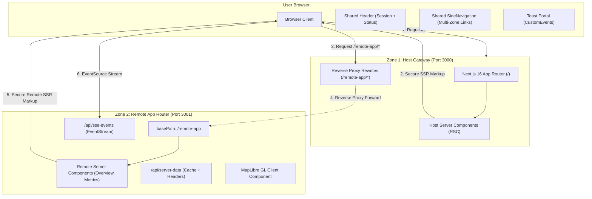

# Definitive Architectural Guide: Next.js 16 App Router Multi-Zones Architecture

This document serves as the complete architectural reference, design documentation, and operational manual for the **Next.js 16 App Router Multi-Zones Micro-Frontend (MFE)** project.

---

## 1. Executive Summary & Architecture Overview

The **Multi-Zones Architecture** is Next.js's native pattern for scaling large-scale web applications across multiple autonomous squads. Rather than composing JavaScript bundles at runtime in the browser (Module Federation), Multi-Zones decomposes the application along **URL path routes (Micro-Sites)**, with each zone operating as an independent Next.js App Router service.

### Core Stack
- **Framework**: Next.js 16 (`16.3.4`) with native **Turbopack** build compiler.
- **Rendering Model**: **React 19 Server Components (RSC)** with secure Server-Side Rendering (SSR).
- **Workspace Architecture**: **pnpm workspaces** with a shared Design System & Session package (`@mfe/ui-shell`).
- **Reverse Proxy Routing**: Zero-hop path rewrites seamlessly directing traffic through the Host Gateway on Port 3000.



---

## 2. Monorepo Project Structure

```
nextjs-mfe/
├── packages/
│   └── ui-shell/                     # Shared UI Shell, Layout, Session & Event Bus
│       ├── package.json
│       ├── tsconfig.json
│       ├── src/
│       │   ├── Header.tsx            # Client Component (Session selector, Status pill)
│       │   ├── SideNavigation.tsx    # Client Component (Multi-zone path navigation)
│       │   ├── ToastContainer.tsx    # Client Component (Global notification portal)
│       │   ├── ShellLayout.tsx       # Root layout wrapper for App Router
│       │   ├── session.ts            # Cookie-based session sync & validation
│       │   ├── events.ts             # CustomEvents & notification dispatcher
│       │   ├── logger.ts             # Isomorphic ANSI stdout & CSS console logger
│       │   └── index.ts
│       └── styles/
│           └── globals.css           # Unified design tokens & responsive CSS
├── apps/
│   ├── host/                         # Zone 1: Host Gateway (Port 3000)
│   │   ├── next.config.js            # Rewrites /remote-app/* -> http://localhost:3001
│   │   ├── package.json              # Next.js 16 App Router setup
│   │   ├── tsconfig.json
│   │   └── app/
│   │       ├── layout.tsx            # Zone 1 Root Layout using ShellLayout
│   │       ├── page.tsx              # Zone 1 Gateway Diagnostics (RSC)
│   │       └── not-found.tsx
│   └── remote/                       # Zone 2: Remote Application (Port 3001)
│       ├── next.config.js            # basePath & assetPrefix: '/remote-app'
│       ├── package.json              # Next.js 16 App Router + MapLibre GL
│       ├── tsconfig.json
│       ├── types/index.ts            # Shared domain types
│       ├── components/
│       │   ├── ServerCard.tsx        # Hydrated SSR diagnostic card with counter
│       │   ├── RemoteTelemetry.tsx   # EventSource SSE stream consumer
│       │   └── RemoteMap.tsx         # MapLibre GL WebGL geospatial map
│       ├── lib/
│       │   ├── cache.ts              # In-memory TTL cache
│       │   └── getServerData.ts      # Server-side diagnostic engine
│       └── app/                      # App Router with basePath /remote-app
│           ├── layout.tsx            # Zone 2 Root Layout using ShellLayout
│           ├── page.tsx              # ServerCard Overview Server Component
│           ├── telemetry/page.tsx    # Live Telemetry Stream route
│           ├── map/page.tsx          # MapLibre GL Fleet Map route
│           ├── metrics/page.tsx      # Cache & Runtime Diagnostics route
│           └── api/
│               ├── server-data/
│               │   └── route.ts      # GET /remote-app/api/server-data
│               └── sse-events/
│                   └── route.ts      # GET /remote-app/api/sse-events (EventStream)
└── scripts/
    ├── verify-poc.mjs                # 7-Pillar Multi-Zones verification suite
    ├── verify-ssr.mjs                # Multi-Zone SSR assertion test
    └── verify-resilience.mjs         # Process fault-tolerance test
```

---

## 3. The 7 Pillars of the Multi-Zones Architecture

### Pillar 1: Session Management & Security-First SSR
- **Cookie-Backed Identity**: When a user profile is selected in the `<Header />`, the session is persisted to an `mfe_user_session` cookie (`SameSite=Lax; path=/`).
- **Server Security**: In Next.js 16 Server Components (`app/page.tsx`), sessions are extracted securely on the server via `cookies()` without exposing tokens or secrets to client JavaScript bundles.

```typescript
// Secure Server Component session extraction (apps/remote/app/page.tsx)
import { cookies } from 'next/headers';
import { parseSessionFromCookieHeader, SESSION_COOKIE_NAME } from '@mfe/ui-shell';

export default async function RemoteOverviewPage() {
  const cookieStore = await cookies();
  const sessionCookie = cookieStore.get(SESSION_COOKIE_NAME)?.value;
  const session = parseSessionFromCookieHeader(
    sessionCookie ? `${SESSION_COOKIE_NAME}=${sessionCookie}` : null
  );

  // Sensitive data fetched exclusively on the Node server
  const serverData = await getServerData(session);

  return <ServerCard initialData={serverData} session={session} />;
}
```

### Pillar 2: Shared UI Shell (`@mfe/ui-shell`)
Both applications import `<ShellLayout />` from the shared workspace package. This gives users a 100% unified visual experience:
- Persistent header with live zone indicator.
- Unified sidebar routing between Zone 1 (`/`) and Zone 2 (`/remote-app`, `/remote-app/telemetry`, `/remote-app/map`, `/remote-app/metrics`).
- Global Toast notification portal.

### Pillar 3: Real-Time SSE Stream with Next.js 16 Route Handlers
The real-time telemetry stream is implemented using standard Web APIs and Next.js 16 `ReadableStream` route handlers:
- Endpoint: `GET /remote-app/api/sse-events`
- Served with `Content-Type: text/event-stream` and `Cache-Control: no-cache, no-transform`.
- The Host reverse-proxy forwards the event stream without buffering.

### Pillar 4: Server-Side Rendering (SSR) & React 19 Server Components
Unlike Module Federation (which requires complex Webpack runtime loaders for SSR chunks), Multi-Zones uses **native Next.js Server Components**:
- Zone 1 server renders Zone 1 HTML.
- Zone 2 server renders Zone 2 HTML.
- Result: 0ms runtime bundle negotiation latency, faster TTFB, and zero shared-dependency version collision bugs.

### Pillar 5: Server Memory Caching with TTL
- Diagnostic data in `getServerData()` is cached in memory with a 5-second TTL per user identity.
- Responses return standard HTTP cache headers (`Cache-Control: public, s-maxage=5, stale-while-revalidate=10`).

### Pillar 6: Multi-Zone Path Routing & Deep-Linking
- Zone 1 handles `/` on port 3000.
- Zone 2 handles `/remote-app/*` on port 3001.
- All Zone 2 paths are accessible directly through port 3000 via Host rewrites:
  - `http://localhost:3000/remote-app` -> Overview
  - `http://localhost:3000/remote-app/telemetry` -> Telemetry
  - `http://localhost:3000/remote-app/map` -> Map
  - `http://localhost:3000/remote-app/metrics` -> Metrics

### Pillar 7: MapLibre GL WebGL Integration
The MapLibre GL geospatial map runs as a client component (`'use client'`) inside `/remote-app/map`:
- Renders 4 fleet nodes (São Paulo, San Francisco, London, Tokyo) with custom status pins and coordinates.
- Interacting with markers dispatches `mfe:map-select` and toasts across the UI shell.

---

## 4. Multi-Zone Reverse Proxy Configuration

### Host Zone Configuration (`apps/host/next.config.js`)
```javascript
/** @type {import('next').NextConfig} */
const nextConfig = {
  reactStrictMode: true,
  async rewrites() {
    const remoteUrl = process.env.REMOTE_ZONE_URL || 'http://localhost:3001';
    return [
      {
        source: '/remote-app',
        destination: `${remoteUrl}/remote-app`,
      },
      {
        source: '/remote-app/:path*',
        destination: `${remoteUrl}/remote-app/:path*`,
      },
    ];
  },
};

module.exports = nextConfig;
```

### Remote Zone Configuration (`apps/remote/next.config.js`)
```javascript
/** @type {import('next').NextConfig} */
const nextConfig = {
  reactStrictMode: true,
  basePath: '/remote-app',
  assetPrefix: '/remote-app',
};

module.exports = nextConfig;
```

---

## 5. Operational Commands & Verification Guide

### 1. Workspace Typechecking
Validates all TypeScript definitions across `@mfe/ui-shell`, `@mfe/host`, and `@mfe/remote`:
```bash
pnpm typecheck
```

### 2. Turbopack Production Build
Compiles all zones with Next.js 16 Turbopack:
```bash
pnpm build
```

### 3. Running the Multi-Zone Environment
Starts both Zone 1 (Port 3000) and Zone 2 (Port 3001) concurrently:
```bash
pnpm start
# Or for live hot-reloading development:
pnpm dev
```

### 4. Running the Verification Test Suites
While the servers are running:
```bash
# 1. Verify SSR across both zones via Port 3000
pnpm verify:ssr

# 2. Verify all 7 Multi-Zone PoC Pillars
pnpm verify:poc

# 3. Verify Zone 1 process isolation & fault tolerance
pnpm verify:resilience
```
