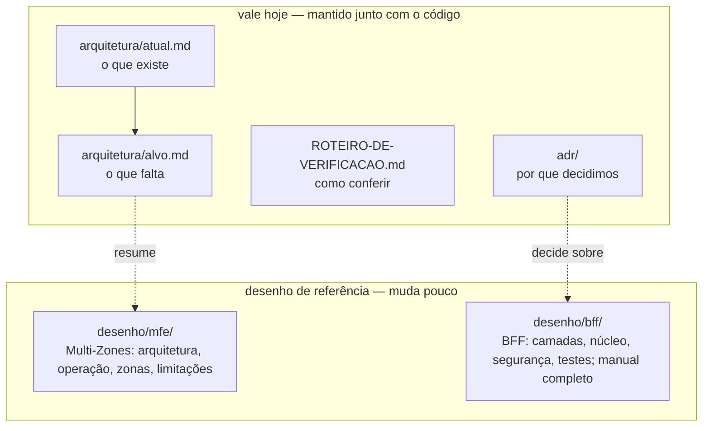

# Documentação — por onde começar

Três perguntas, três lugares:

| Quero saber… | Leia | Tamanho |
|---|---|---|
| **como a gestão de acesso deve funcionar** (modelo de referência, API proposta e mock) | [`gestao-acesso/MODELO.md`](gestao-acesso/MODELO.md) | 10 min |
| **quem faz o quê** (BFF de cada MFE, clientes, domínios, pacotes), explicado do zero | [`RESPONSABILIDADES.md`](RESPONSABILIDADES.md) — começa pelo vocabulário | 15 min |
| **como a base funciona hoje** | [`arquitetura/atual.md`](arquitetura/atual.md) — diagramas de topologia, proxy, login, destinos, acesso, toast, testes e falhas | 10 min |
| **o que falta e para onde vai** | [`arquitetura/alvo.md`](arquitetura/alvo.md) — a tabela do §6 é a lista do que falta | 10 min |
| **que parâmetro controla o quê** (sessão, timeouts, limites) | [`CONFIGURACAO.md`](CONFIGURACAO.md) — toda variável, com padrão e quem lê | 5 min |
| **como conferir com as próprias mãos** | [`ROTEIRO-DE-VERIFICACAO.md`](ROTEIRO-DE-VERIFICACAO.md) — 12 passos no navegador | 10 min |

Para rodar a base: [`../README.md`](../README.md). Para retomar o trabalho em andamento:
[`../.agents/orchestrator/LEIA-PRIMEIRO.md`](../.agents/orchestrator/LEIA-PRIMEIRO.md).

## Mapa

## Desenho de referência

Muda pouco. Explica o porquê e o alvo; o que existe hoje está em `arquitetura/atual.md`. Os
documentos que usam o caso "Pedidos" trazem um aviso no topo: é ilustração.

| Pergunta | Documento |
|---|---|
| quais são as regras, em versão longa? | [`desenho/bff/manual-completo.md`](desenho/bff/manual-completo.md) (a curta é o `AGENTS.md` da raiz) |
| como o BFF se divide em camadas, núcleo e extensões? | [`01-camadas`](desenho/bff/01-camadas.md), [`02-nucleo`](desenho/bff/02-nucleo.md), [`03-extensoes`](desenho/bff/03-extensoes.md) |
| onde mora cada rota e serviço? | [`04-servicos`](desenho/bff/04-servicos.md) |
| como é a segurança (sessão, CSP, 401/403/404)? | [`06-seguranca`](desenho/bff/06-seguranca.md) |
| observabilidade, desempenho, convenções, runbook, testes | [`07`](desenho/bff/07-observabilidade.md) · [`08`](desenho/bff/08-desempenho.md) · [`09`](desenho/bff/09-convencoes.md) · [`10`](desenho/bff/10-runbook.md) · [`11`](desenho/bff/11-testes.md) |
| qual foi a spec da base (topologia, camadas, critério de pronto)? | [`desenho/base-mfe-spec.md`](desenho/base-mfe-spec.md) |
| o que ainda bloqueia produção? | [`PENDENCIAS`](desenho/bff/PENDENCIAS.md) |
| que erros já cometemos? | [`CORRECOES`](desenho/bff/CORRECOES.md) |
| como é a arquitetura Multi-Zones alvo? | [`mfe/00-arquitetura`](desenho/mfe/00-arquitetura.md) |
| como rotear, subir, derrubar e fazer deploy de zonas? | [`mfe/01-operacao`](desenho/mfe/01-operacao.md) |
| como é uma zona e o contrato de fragmento? | [`mfe/02-zonas`](desenho/mfe/02-zonas.md) |
| o que o Multi-Zones não resolve sozinho? | [`mfe/limitacoes-do-multizones`](desenho/mfe/limitacoes-do-multizones.md) |
| o que muda rodando fora da Vercel? | [`mfe/infraestrutura-fora-da-vercel`](desenho/mfe/infraestrutura-fora-da-vercel.md) |

Também em `desenho/bff/`: caso ilustrativo (`00`), decisões antigas (`05`), trilha (`12`),
glossário (`13`), variantes de cache (`14`).

## Decisões (ADRs)

| ADR | Decisão |
|---|---|
| [0001](adr/0001-bff-em-vez-de-token-no-navegador.md) | BFF no servidor; token nunca vai ao navegador |
| [0002](adr/0002-redis-como-store-de-sessao.md) | Redis como store de sessão (hoje: arquivo, em desenvolvimento) |
| [0003](adr/0003-cache-com-escopo.md) | Cache sempre com escopo |
| [0004](adr/0004-sse-em-vez-de-websocket.md) | SSE em vez de WebSocket |
| [0005](adr/0005-tanstack-query-com-escopo-limitado.md) | TanStack Query com escopo limitado |
| [0006](adr/0006-csp-nonce-vs-estatico.md) | CSP com nonce |
| [0007](adr/0007-remover-cache-de-payload.md) | Sem cache de payload |
| [0008](adr/0008-multi-zones-como-base-mfe.md) | Multi-Zones como base de micro-frontends |
| [0009](adr/0009-base-generica.md) | Base genérica: sem domínio no núcleo; shell + 2 zonas + gestão de acesso |
| [0010](adr/0010-reconciliacao-do-nucleo.md) | Reconciliação de dois `@erp/nucleo` 0.3.1; versão nunca republicada |
| [0011](adr/0011-fragmento-entre-zonas.md) | Fragmento entre zonas: fábrica do núcleo, cookie como identidade, ausência é 204 |
| [0012](adr/0012-kit-de-app-no-nucleo.md) | Kit de app `@erp/nucleo/app` no lugar das 4 cópias; o núcleo não importa a moldura |
| [0013](adr/0013-login-oidc-e-renovacao-proativa.md) | *(proposto)* Login OIDC + PKCE e renovação proativa no proxy do shell; substitui a decisão 3 do 0009 |

## Regras para esta pasta

- **Documento vivo muda no mesmo commit que o código.** Se `atual.md` e o código divergirem, o
  código manda e o documento está errado.
- **O atual e o alvo ficam separados.** `atual.md` descreve só o que existe; o que falta vai para
  `alvo.md` §6.
- **Decisão nova vira ADR**, numerado em sequência, com contexto, decisão e consequências.
- **Documento encerrado sai do repositório** (`git rm`); o git e as tags guardam.
- Tudo em português. Diagramas em Mermaid, para renderizar no GitHub/GitLab.

## Histórico

O que não vale mais como estado **não fica no repositório**: sai por `git rm` e continua no
histórico do git.

| Tag | O que preserva |
|---|---|
| `poc-final` | a PoC inteira (`apps/`, `packages/shell-ui`), com a documentação dela |
| `historico-2026-09-22` | pesquisa inicial, planos e specs da PoC, revisão de 2026-09-15, pastas dos verificadores de gates encerrados |
