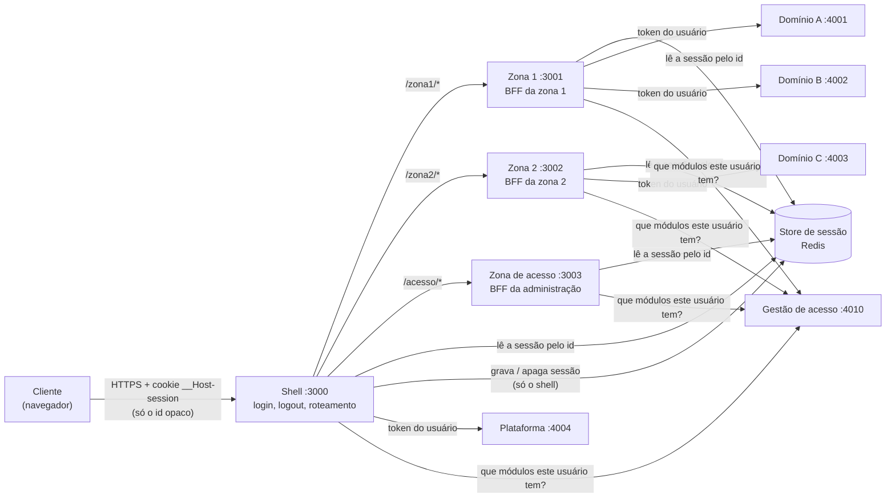

# Responsabilidades — quem faz o quê na base

Este documento responde, para cada parte do sistema, a três perguntas: **o que ela é**, **o que é
responsabilidade dela** e **o que ela nunca faz**. Não pressupõe conhecimento prévio: a seção 1 explica
cada termo usado depois. Se você já conhece os termos, pule para a seção 2.

Para rodar e ver tudo funcionando: `task showcase` (README da raiz). Para as regras em forma de lista
curta: [`AGENTS.md`](../AGENTS.md). Para os parâmetros configuráveis: [`CONFIGURACAO.md`](CONFIGURACAO.md).

---

## 1. Vocabulário (leia antes do resto)

| Termo | O que significa aqui |
|---|---|
| **Cliente** | Tudo o que roda no computador do usuário: o **navegador** e o código JavaScript que ele executa. Qualquer coisa que chega ao cliente pode ser lida pelo usuário (e por um atacante com acesso à máquina). |
| **Servidor** | Os processos que rodam do nosso lado (Node.js). O usuário não vê o que acontece ali; só recebe as respostas. |
| **Domínio** (ou *backend de domínio*) | Um serviço de negócio que guarda e decide sobre dados: por exemplo "recursos", "tarefas", "gestão de acesso". Aqui eles são simulados por `repos/erp-dominio-stub` (APIs em Node.js com dados em JSON). O domínio **nunca** é acessado diretamente pelo navegador. |
| **BFF** (*Backend for Frontend*) | Um servidor que fica **entre o navegador e os domínios**, feito sob medida para uma tela. Ele recebe o pedido do navegador, descobre quem é o usuário, chama os domínios com a credencial certa e devolve só o que a tela precisa. Nesta base, **cada aplicação Next.js é o BFF de si mesma**: o mesmo processo que desenha a página no servidor faz as chamadas aos domínios. |
| **MFE** (*micro-frontend*) | Um pedaço da interface desenvolvido e implantado de forma independente dos outros. Aqui cada MFE é uma aplicação Next.js própria, num repositório próprio, com processo próprio. |
| **Zona** | O nome que o Next.js dá (recurso *Multi-Zones*) a cada MFE: uma aplicação que responde por um prefixo de URL. A zona 1 responde por `/zona1/...`, a zona 2 por `/zona2/...`, a zona de acesso por `/acesso/...`. |
| **Shell** | A aplicação que recebe **todas** as requisições do navegador (`http://localhost:3000`) e as repassa para a zona dona do prefixo. Também é a única que faz login e logout. O navegador só conhece o endereço do shell. |
| **Sessão** | O registro, guardado no servidor, de que um usuário entrou: quem ele é e o *token* para falar com os domínios. Fica num **store de sessão** (Redis no showcase; arquivo em desenvolvimento). |
| **Cookie de sessão** | O que o navegador guarda para ser reconhecido: `__Host-session`, contendo **só um identificador aleatório** (opaco). Ele não contém nome, perfil nem token; é só a chave para achar a sessão no store. `HttpOnly` impede o JavaScript da página de lê-lo. |
| **Token de acesso** (`access_token`) | A credencial que prova para o domínio quem é o usuário. Vive **só no servidor**, dentro da sessão. Nunca vai para o navegador. |
| **IdP / SSO** | O provedor de identidade (aqui, **Keycloak**): quem confere a senha e emite os tokens. O login único (*single sign-on*) acontece nele. Hoje as apps usam um login de desenvolvimento; a troca para o Keycloak está desenhada no [ADR-0013](adr/0013-login-oidc-e-renovacao-proativa.md). |
| **Server Component** | Componente React que roda **só no servidor**. Pode ler a sessão e chamar domínios; o navegador recebe apenas o HTML/resultado. É o padrão no Next.js App Router. |
| **Componente de cliente** (*ilha*) | Componente React marcado com `'use client'`: roda no navegador (para ter clique, estado, efeitos). Tudo o que ele recebe como *prop* é enviado ao navegador. |
| **Server Action** | Função do servidor (arquivo com `'use server'`) que um formulário ou botão da página chama para **mudar dados**. Apesar de estar no mesmo código da página, é um endereço público: qualquer um pode chamá-la, por isso ela reconfere tudo. |
| **Módulo** | Uma funcionalidade que pode ser concedida ou negada a um usuário (ex.: `zona1.relatorios`). Quem decide é o domínio de **gestão de acesso**. |
| **Manifesto** | Arquivo de cada aplicação (`acesso.manifesto.ts`) que declara os módulos e perfis dela. É enviado à gestão de acesso na implantação (`pnpm registrar`). |
| **Registro de destinos** | A lista, em `lib/nucleo.ts` de cada app, de **quais domínios e quais caminhos** aquela app pode chamar. Chamada fora da lista é recusada. |
| **Núcleo** (`@erp/nucleo`) | Pacote compartilhado com o que é igual em todas as apps e decide segurança: sessão, registro de destinos, verificação de módulo, CSP, envelope de Server Action. |
| **Moldura** (`@erp/moldura`) | Pacote compartilhado com a parte visual comum: topo, menu, avisos (*toasts*), página de "serviço indisponível". Não decide acesso. |

---

## 2. Como um pedido atravessa o sistema

Passo a passo, quando alguém abre `/zona2`:

1. O **navegador** manda o pedido ao **shell**, com o cookie `__Host-session`.
2. O **shell** confere se o cookie existe (se não, manda para `/login`), confere se a zona 2 está no ar
   (se não, responde 503 com uma página própria) e repassa o pedido para a **zona 2**.
3. A **zona 2** (o BFF dela) usa o id do cookie para ler a sessão no **store**. Sem sessão válida, manda ao login.
4. A zona 2 pergunta à **gestão de acesso** se o usuário tem o módulo `zona2.tarefas`. Não tem: responde **404**
   (como se a página não existisse). Tem: continua.
5. A zona 2 chama o **domínio C** com o token do usuário, recebe as tarefas **já filtradas pelo domínio** e
   desenha a página no servidor.
6. O navegador recebe **só o HTML** da página e o mínimo para os botões funcionarem. Nenhum token, nenhuma lista
   de grupos, nenhum campo que a tela não mostra.

---

## 3. Responsabilidades do BFF (vale para toda aplicação)

"BFF" aqui é o lado servidor de cada aplicação Next.js: `lib/nucleo.ts`, `lib/pagina.ts`, os Server Components
das páginas, as Server Actions e os *route handlers* (`app/**/route.ts`).

### O BFF é responsável por

| Responsabilidade | Como, nesta base |
|---|---|
| **Saber quem é o usuário** em todo pedido | lê a sessão pelo id do cookie (`sessaoDaPagina()`); sem sessão, manda ao login |
| **Verificar o módulo** antes de mostrar uma página | `await exigirModulo('<zona>.<modulo>')` no início de toda página de módulo; negado = 404 |
| **Reconferir tudo em toda Server Action** | a action roda dentro de `acaoProtegida(modulo, voltar, corpo)`, que confere origem do pedido, sessão e módulo **antes** de qualquer efeito |
| **Chamar domínios só pelo registro de destinos** | `nucleo.destino('dominio-c').get('/v1/tarefas')`; o registro põe a origem, o método permitido, o token e o timeout |
| **Mandar ao domínio a versão que o usuário conhece** ao alterar um recurso versionado | cabeçalho `If-Match` (o domínio recusa se a versão mudou) |
| **Entregar ao navegador só o necessário** | Server Components renderizam no servidor; para um componente de cliente, passar só valores simples (texto, número), nunca o objeto inteiro do domínio |
| **Transformar erro em mensagem pública** | todo erro vira `{ codigo, supportId }`; nunca stacktrace, nome de classe ou mensagem interna |
| **Proteger a página no navegador** | CSP com *nonce* novo a cada pedido (o navegador só executa os scripts que a própria página marcou) |

### O BFF nunca

- manda `access_token`, `refresh_token` ou lista de grupos ao navegador;
- decide sozinho se o usuário **pode** ver um dado: quem decide é o **domínio** (o BFF só repassa o que ele devolve);
- usa `fetch` direto para um domínio (fora do registro de destinos);
- cria endpoint que funcione **sem** o cookie de sessão (o único cliente do BFF é o navegador do próprio usuário);
- guarda em cache uma resposta com dado protegido;
- cria variável `NEXT_PUBLIC_*` com credencial ou endereço interno (essas vão para o navegador);
- grava, renova ou apaga sessão — **exceto o shell**.

### As quatro camadas de verificação (e por que só a última é segurança de verdade)

| Camada | Onde | Para quê |
|---|---|---|
| 1 | `proxy.ts` (antes da página) | existe cookie? se não, login. Experiência: evita desenhar página à toa |
| 2 | página e action (`exigirModulo`, `acaoProtegida`) | o usuário tem o módulo? se não, 404 |
| 3 | interface | o botão que o usuário não pode usar nem aparece |
| 4 | **domínio** | a regra real: o dado e a ação são decididos lá. É a única que uma chamada direta (ex.: `curl`) não contorna |

---

## 4. Cada MFE e o seu BFF

### 4.1 Shell — `repos/erp-shell` (porta 3000)

**O que é:** a porta de entrada. O navegador só fala com ele.

| É responsabilidade do shell | Arquivos |
|---|---|
| Receber todo pedido e repassar à zona dona do prefixo (mapa `zonas.json`) | `proxy.ts`, `lib/decisao-proxy.ts`, `lib/zonas.ts`, `zonas.json` |
| Conferir se cada zona está no ar (sonda com cache curto) e, se não, responder 503 com página própria | `lib/saude-zonas.ts`, `app/(publico)/erro-de-zona/` |
| **Login e logout** — é a única app que cria e apaga sessão | `app/api/auth/entrar/route.ts`, `app/api/auth/sair/route.ts`, `lib/nucleo.ts` (`criarNucleoDoShell`) |
| Página inicial e avisos da plataforma (domínio `plataforma`) | `app/(app)/page.tsx` |
| Receber a telemetria (traces) das zonas, só de quem tem sessão, com limite de tamanho e de taxa | `app/api/otel/v1/traces/route.ts`, `lib/telemetria.ts` |
| Página de login (hoje: desenvolvimento, sem senha) | `app/(publico)/login/` |

**BFF do shell chama:** `plataforma` (`/v1/avisos`), `gestao-acesso` (`/v1/modulos-permitidos`) e, se configurado,
o coletor de telemetria. **Módulo:** `shell.inicio`.

**O shell nunca:** implementa regra de negócio de uma zona; mostra conteúdo de zona (ele só repassa).

### 4.2 Zona 1 — `repos/erp-zona-1` (porta 3001, prefixo `/zona1`)

**O que é:** exemplo de zona que **lê** dados de **dois domínios** e mostra o mesmo recurso de forma diferente para
cada usuário.

| É responsabilidade da zona 1 | Arquivos |
|---|---|
| Painel com recursos (domínio A) e indicadores (domínio B) | `app/zona1/page.tsx` |
| Relatórios com custo — só para quem tem `zona1.relatorios` | `app/zona1/relatorios/page.tsx` |
| Detalhe de um recurso; o campo **custo** só aparece se o domínio A o devolver (grupo FINANCEIRO) | `app/zona1/recursos/[id]/page.tsx` |
| Botão que dispara um aviso no toast do shell (componente de cliente que recebe **só um texto**) | `app/zona1/BotaoDeAviso.tsx` |

**BFF da zona 1 chama:** `dominio-a` (`/v1/recursos`, `/v1/recursos/:id`), `dominio-b` (`/v1/indicadores`),
`gestao-acesso`. **Módulos:** `zona1.painel`, `zona1.relatorios`; **perfil:** `zona1.analista`.

### 4.3 Zona 2 — `repos/erp-zona-2` (porta 3002, prefixo `/zona2`)

**O que é:** exemplo de zona que **altera** dados, com controle de versão.

| É responsabilidade da zona 2 | Arquivos |
|---|---|
| Lista de tarefas (domínio C) | `app/zona2/page.tsx` |
| Server Action "concluir tarefa": dentro de `acaoProtegida('zona2.tarefas', ...)`, manda `If-Match` com a versão conhecida; ao terminar, grava um aviso (*flash*) e leva o usuário para a zona 1, onde o aviso aparece uma vez | `app/zona2/acoes.ts` |

**BFF da zona 2 chama:** `dominio-c` (`GET /v1/tarefas`, `POST /v1/tarefas/:id/concluir`), `gestao-acesso`.
**Módulo:** `zona2.tarefas`; **perfil:** `zona2.operador`. Quem pode concluir é decidido pelo domínio C (grupo OPERACAO).

### 4.4 Zona de acesso — `repos/erp-zona-acesso` (porta 3003, prefixo `/acesso`)

**O que é:** a tela de administração da gestão de acesso.

| É responsabilidade da zona de acesso | Arquivos |
|---|---|
| Mostrar o catálogo (zonas, módulos, perfis, usuários) que a gestão de acesso devolve | `app/acesso/page.tsx` |
| Server Actions para conceder/retirar módulo de um perfil, restringir módulo e atribuir perfil a usuário | `app/acesso/acoes.ts` |

**BFF da zona de acesso chama:** `gestao-acesso` (`/v1/modulos-permitidos`, `/v1/catalogo`, `/v1/concessoes`,
`/v1/restricoes`, `/v1/atribuicoes`). **Módulo:** `acesso.admin`. As regras (quem é administrador, perfil de uma zona
não concede módulo de outra) moram na **gestão de acesso**, não na tela: a tela só oferece o que o domínio diz ser possível.

### 4.5 O que toda zona tem igual

- `lib/nucleo.ts`: instância do núcleo com **só** os destinos daquela zona. Sessão em **leitura** (zonas não gravam sessão).
- `lib/pagina.ts`: liga o kit do núcleo e da moldura ao Next (não tem lógica própria; é igual nas quatro apps).
- `lib/redis.ts`: cliente do Redis, usado só se `REDIS_URL` estiver definido.
- `proxy.ts`: camada 1 (cookie existe?) e a CSP da zona.
- `acesso.manifesto.ts` e `scripts/registrar-manifesto.ts`: módulos da zona, enviados à gestão de acesso.
- **Uma zona nunca** importa `@erp/nucleo/shell` (o que grava sessão), nunca declara módulo com prefixo de outra zona, e
  nunca linka para outra zona com `<Link>` do Next (entre zonas o navegador troca de documento com `<a>` normal).

---

## 5. Responsabilidades dos clientes

"Cliente" é o navegador e o código que roda nele: os componentes `'use client'` e o JavaScript que o Next envia.

### O que o cliente recebe

- HTML já desenhado no servidor, com o menu e os dados **que aquele usuário pode ver**;
- o cookie `__Host-session` (só o id, `HttpOnly`: o JavaScript não o lê);
- as props dos componentes de cliente — por isso elas precisam ser **valores simples e não sensíveis**.

### O que o cliente nunca recebe

- token de acesso, refresh token, id token;
- lista de grupos ou perfis do usuário (o menu já vem filtrado);
- endereço interno de domínio ou qualquer segredo;
- campo que a tela não mostra (um objeto inteiro passado a um componente de cliente iria inteiro — inclusive campos escondidos).

### Como o cliente pede e muda dados

| Quer… | Faz | Quem confere |
|---|---|---|
| ver uma página | navega para a URL (via shell) | BFF da zona: sessão e módulo; domínio: o dado |
| mudar algo | envia o formulário/botão que chama uma **Server Action** | `acaoProtegida` (origem, sessão, módulo) e depois o domínio |
| avisar o usuário | `emitirToast({ tipo, texto })` da moldura | — (só visual) |
| dado que a tela busca depois de carregada *(ainda não usado na base)* | `fetch` para `app/{zona}/api/bff/...` com o cookie | o route handler, com as mesmas regras do BFF |

### Responsabilidades de quem escreve código de cliente

- **Não confiar no cliente para segurança.** Esconder um botão é conforto; a proteção está no BFF e no domínio.
- **Nunca mostrar um "você não tem acesso".** Sem permissão, o elemento simplesmente não existe.
- **Passar só o necessário** a um componente de cliente (ex.: `texto`, não o objeto `recurso`).
- **Não guardar dado protegido** em `localStorage`, `sessionStorage` ou cache do navegador.
- **Não fazer `fetch` para domínio.** O navegador só fala com o shell; o domínio recusa pedidos vindos de navegador.

---

## 6. Domínios e gestão de acesso

| Parte | É responsável por | Nunca |
|---|---|---|
| **Domínios de negócio** (A, B, C, plataforma) | guardar os dados, decidir quem vê o quê (**escopo**: recurso fora do alcance = 404) e quais campos vão na resposta (**projeção**: `custo` só para FINANCEIRO), decidir quem pode alterar (403) e recusar versão desatualizada (`If-Match`, 409) | aceitar pedido vindo do navegador; confiar em perfil de plataforma como permissão de dado |
| **Gestão de acesso** | guardar os manifestos das zonas, perfis, módulos, concessões e atribuições; responder "que módulos este usuário tem"; aplicar as regras de administração | deixar uma zona registrar manifesto de outra; deixar perfil de uma zona conceder módulo de outra |

Nesta base, os dois são simulados por `repos/erp-dominio-stub` (dados em `dados/semente/*.json`). A evolução
da gestão de acesso — unidades, papéis com escopo, módulos com validação, auditoria — está descrita em
[`gestao-acesso/MODELO.md`](gestao-acesso/MODELO.md), com a API proposta já simulada na porta 4020.

---

## 7. Pacotes compartilhados

| Pacote | Responsável por | Nunca |
|---|---|---|
| `@erp/contratos` | tipos e validação do que atravessa as fronteiras: manifesto, códigos de erro e suas mensagens públicas | ter código de tela ou de servidor |
| `@erp/nucleo` | tudo que decide segurança e é igual em todas as apps: sessão, registro de destinos, `exigirModulo`/`acaoProtegida` (`/app`), CSP e camada 1 (`/proxy`), escrita de sessão e login (`/shell`, só o shell) | conhecer um domínio de negócio; depender da moldura |
| `@erp/moldura` | a parte visual comum: topo, menu, toast, formulário de action, páginas de indisponibilidade e erro (`/servidor` para a parte que roda no servidor) | decidir acesso (recebe a decisão já tomada pelo núcleo) |

As quatro apps usam **a mesma versão exata** do núcleo (hoje 0.7.0); o `pre-push` recusa se não usarem.

---

## 8. "Preciso de…" — onde colocar

| Preciso de… | Coloque em | Não coloque em |
|---|---|---|
| mostrar dado de um domínio | Server Component da página, via `nucleo.destino(...)` | componente de cliente |
| mudar dado | Server Action dentro de `acaoProtegida` | route handler sem módulo; `fetch` do cliente para o domínio |
| interação no navegador (clique, estado) | componente `'use client'` recebendo só valores simples | lógica de permissão |
| um módulo novo | manifesto da zona (`<zona>.<nome>`) + `exigirModulo` na página | manifesto de outra zona |
| uma zona nova | novo repositório seguindo zona 1/2, entrada em `zonas.json` do shell (README da raiz, "Escalar") | dentro de outra zona |
| um tempo, limite ou timeout | variável de ambiente documentada em `CONFIGURACAO.md` | constante no código |
| algo chamado de fora da aplicação (outro sistema) | no **domínio** | no BFF |
