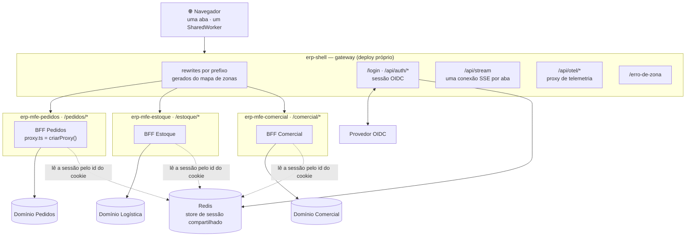
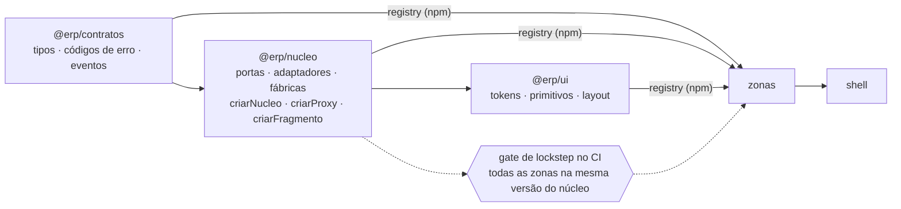
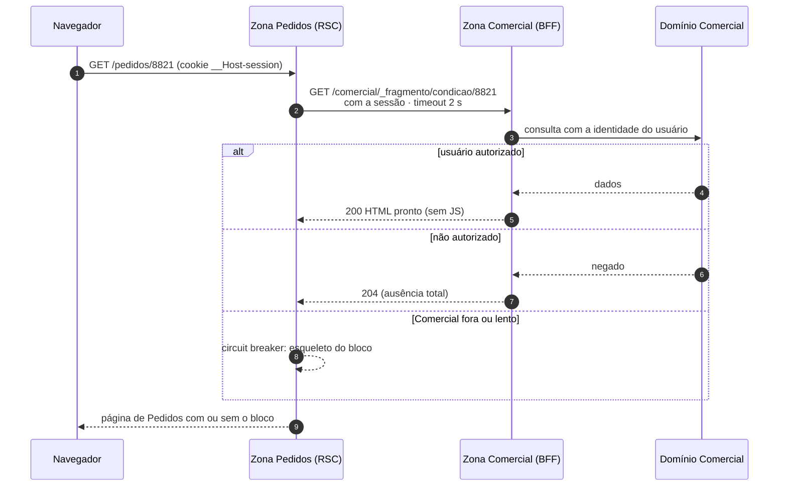
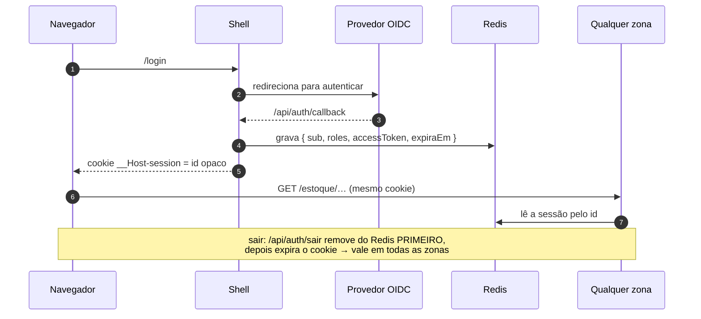
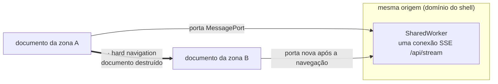

# Arquitetura alvo

> **O que isto descreve:** para onde a base deve chegar, resumido do desenho completo em
> `docs/design-bff/mfe/` (`00-arquitetura.md`, `01-operacao.md`, `02-zonas.md`). Aquele
> desenho manda; este arquivo é o mapa visual dele. O que existe hoje está em
> [`atual.md`](atual.md). A tabela do fim mostra o que falta.

A PoC atual prova o mecanismo (Multi-Zones, rewrites, queda isolada, moldura comum). O alvo
é um ERP com **várias zonas de times diferentes**, cada uma com BFF próprio e um único
domínio, com sessão, autorização e composição feitas no servidor.

---

## 1. Topologia

Regras que a figura carrega:

- **Uma zona fala com um domínio.** Precisando de dado de outro, pede um *fragmento* à zona
  dona (§3), que aplica a ACL dela.
- **A zona não é alcançável pelo navegador em produção.** Só existe atrás do shell.
- **O shell nunca delega** `/api/auth/*`, `/api/stream`, `/api/otel/*`, `/login`,
  `/erro-de-zona`: precisam existir mesmo com toda zona fora.

## 2. Pacotes e deploy

Ordem de publicação e deploy: **contratos → núcleo → ui → zonas → shell**. Zonas revertem
de forma independente, mas nunca abaixo do lockstep do núcleo. Contrato só cresce (janela de
depreciação de duas minors).

## 3. Composição entre zonas: `FragmentoRemoto`

- A autorização é avaliada **pelo dono do dado, antes de qualquer byte sair**.
- O `try/catch` e o timeout do fragmento são **núcleo**: sem eles, a queda do Comercial
  derruba o Pedidos.
- Nenhuma parte da URL do fragmento vem do cliente; o destino sai do mapa de zonas.

## 4. Sessão ponta a ponta

O cookie leva só um id opaco, nunca o token. Uma zona nunca implementa saída: redireciona
para a do shell.

## 5. Estado de cliente entre zonas

| O que sobrevive à troca de zona | Como |
|---|---|
| conexão SSE | `SharedWorker` na origem, multiplexando portas de documentos distintos |
| sessão | cookie `__Host-session` + Redis |
| filtro, aba, rascunho | não sobrevive, por desenho: é estado de tela |

---

## 6. Da base atual ao alvo

| Tema | Hoje (`atual.md`) | Alvo | Primeiro passo sugerido |
|---|---|---|---|
| Framework | Next 15, Pages Router | Next 16, App Router (RSC, `proxy.ts`) | migrar uma zona e manter os testes de contrato |
| Zonas | uma (`/remote-app`), nomeada no código em 6 lugares (`README.md` §5) | várias, declaradas num **mapa de zonas** que gera rewrites, allowlist e menu | extrair o mapa para configuração e derivar rewrites, matcher e navegação dele |
| Vivacidade | uma sonda, um cache, middleware não lê o pedido | uma sonda por zona | cache por zona escolhido pelo caminho **cru**, com testes de `..` e `%2e%2e` |
| Sessão | usuário simulado espelhado no `localStorage`, só no cliente (D3) | OIDC + cookie opaco + Redis compartilhado, lida no servidor por toda zona | porta de sessão do `@erp/nucleo` com adaptador fake, depois Redis |
| Autorização | nenhuma | só no domínio; fragmento responde 204 quando negado | contrato do fragmento já existe (200/204/405); falta a identidade |
| Composição | fragmento de demonstração sem consumidor | `FragmentoRemoto` com timeout e circuit breaker | primeiro consumidor real numa segunda zona |
| SSE | um `EventSource` por documento, direto na zona; vazamento de intervalo (D1) | `/api/stream` no shell + `SharedWorker` | corrigir D1 e mover o stream para o shell |
| Moldura / design system | `@mfe/shell-ui` no workspace, código-fonte compilado em cada app | `@erp/ui` publicado com semver tolerante | publicar no registry local (`repos/`) |
| Núcleo e contratos | não usados pela PoC | `@erp/nucleo` e `@erp/contratos` com lockstep no CI | já em desenvolvimento em `repos/erp-nucleo`, `repos/erp-contratos` |
| Deploy | local, `pnpm start` | repositórios e deploys independentes, lockstep | — |
| Testes | unitários + estáticos + smoke; efeitos no navegador sem cobertura (D9, D10) | suíte de invariantes por zona, rodando contra cada zona | adicionar renderizador de DOM ou E2E em navegador |

Referências: `docs/design-bff/mfe/00-arquitetura.md` (solução), `01-operacao.md`
(roteamento, sessão, falha, deploy), `02-zonas.md` (estrutura e criação de zona),
`limitações-mfe-multizone.md` (as limitações que o desenho responde).
