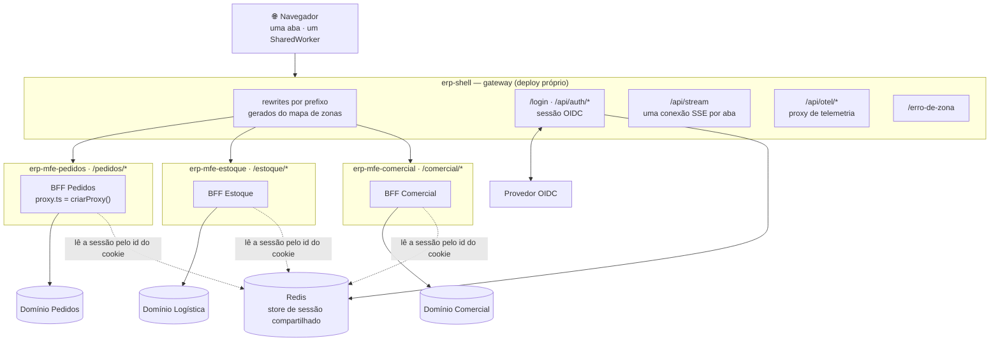
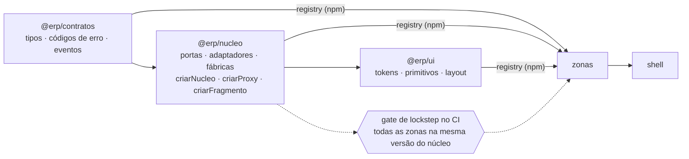
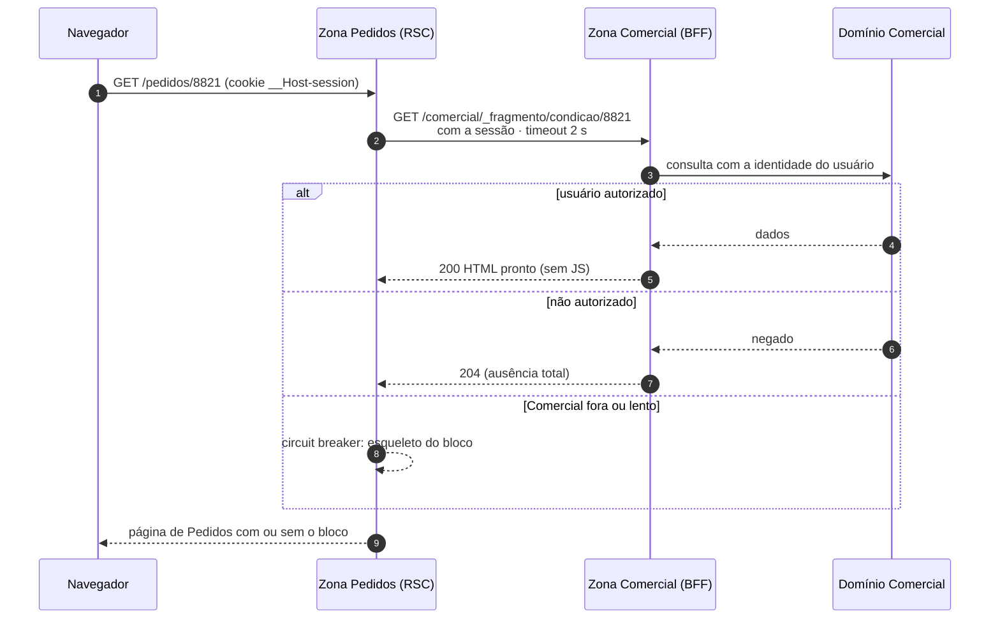
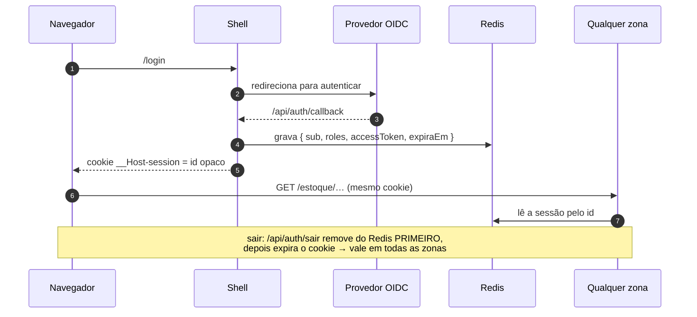
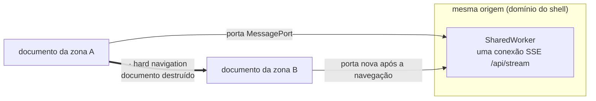

# Arquitetura alvo

> **O que isto descreve:** para onde a base deve chegar, resumido do desenho completo em
> `docs/desenho/mfe/` (`00-arquitetura.md`, `01-operacao.md`, `02-zonas.md`). Aquele
> desenho manda; este arquivo é o mapa visual dele. O que existe hoje está em
> [`atual.md`](atual.md). A tabela do fim mostra o que falta.

A base genérica em `repos/` (ADR-0009) já tem shell, três zonas, gestão de acesso, registro de
destinos e moldura comum. O alvo é um ERP com **várias zonas de times diferentes**, cada uma com
BFF próprio e um ou mais domínios, com sessão, autorização e composição feitas no servidor.

---

## 1. Topologia

Regras que a figura carrega:

- **Uma zona fala com um domínio.** Precisando de dado de outro, pede um *fragmento* à zona
  dona (§3), que aplica a ACL dela.
- **A zona não é alcançável pelo navegador em produção.** Só existe atrás do shell.
- **O shell nunca delega** `/api/auth/*`, `/api/stream`, `/api/otel/*`, `/login`,
  `/erro-de-zona`: precisam existir mesmo com toda zona fora.

## 2. Pacotes e deploy

Ordem de publicação e deploy: **contratos → núcleo → ui → zonas → shell**. Zonas revertem
de forma independente, mas nunca abaixo do lockstep do núcleo. ("Contrato só cresce" é prática
documentada, não critério: §7.2.1.)

## 3. Composição entre zonas: `FragmentoRemoto`

- A autorização é avaliada **pelo dono do dado, antes de qualquer byte sair**.
- O `try/catch` e o timeout do fragmento são **núcleo**: sem eles, a queda do Comercial
  derruba o Pedidos.
- Nenhuma parte da URL do fragmento vem do cliente; o destino sai do mapa de zonas.

## 4. Sessão ponta a ponta

O cookie leva só um id opaco, nunca o token. Uma zona nunca implementa saída: redireciona
para a do shell.

## 5. Estado de cliente entre zonas

| O que sobrevive à troca de zona | Como |
|---|---|
| conexão SSE | `SharedWorker` na origem, multiplexando portas de documentos distintos |
| sessão | cookie `__Host-session` + Redis |
| filtro, aba, rascunho | não sobrevive, por desenho: é estado de tela |

---

## 6. Da base atual ao alvo

| Tema | Hoje (`atual.md`) | Alvo | Primeiro passo sugerido |
|---|---|---|---|
| Framework | Next 16, App Router, `proxy.ts` | igual | — |
| Zonas | shell + 3 zonas; rewrites, sonda e 503 gerados de `zonas.json` | mapa de zonas gerado dos manifestos registrados | ler prefixos e origens do domínio de gestão de acesso no boot do shell |
| Login | `identidadeDev` (4 atores, sem senha) | OIDC + PKCE | adaptador OIDC da porta de identidade |
| Store de sessão | arquivo em disco compartilhado; adaptador `sessaoRedis` **pronto** no núcleo 0.4.0 (leitor na raiz, escritor em `/shell`), ainda não ligado | Redis compartilhado (`noeviction`, AOF) | ligar nas apps: instalar `redis` (node-redis), subir um Redis local no `docker-compose` e trocar o adaptador em `lib/nucleo.ts` — depois do gate do shell |
| Renovação de token | não existe; sessão de dev dura 30 min | endpoint interno do shell (ADR-0009, decisão 3) | depende das respostas do IdP (PENDENCIAS §4) |
| Acesso a módulo | gestão de acesso federada, 404 para módulo negado | igual, com cache por versão de política se a medição pedir | medir a consulta por renderização |
| Falha isolada de zona | 503 com `Retry-After` e página própria, sonda de saúde por zona com cache de 1 s — **implementado, gate reprovou** (C1: caminho com maiúsculas escapa da sonda). A sonda bate na página da zona; **não existe `/{zona}/api/health`** | igual, com zona travada limitada pelo timeout da sonda e sem janela de 500 cru | gate do shell: caminho normalizado × cru (R1 da PoC), zona travada, janela logo após a queda |
| Composição | núcleo 0.5.0 tem `criarFragmento` (consumidor) e `responderFragmento` (dono), ADR-0011; nenhuma zona usa ainda | `FragmentoRemoto` com timeout e circuit breaker | rota `_fragmento` na zona 2, bloco na zona 1, recusa de `/{zona}/_fragmento/` no shell |
| SSE | não há | `/api/stream` no shell + `SharedWorker` | — |
| Design system | `@erp/moldura` (moldura e toast) | `@erp/ui` publicado com semver tolerante | medir duplicação de bundle entre zonas antes |
| Deploy | 8 repositórios como submódulos; hook `pre-push` recusa submódulo não enviado; um Verdaccio **por máquina** | repositórios e deploys independentes, lockstep do núcleo no CI, um registro único | publicar pelos pacotes num registro compartilhado (ou pelo CI): hoje cada máquina republica e os hashes dos lockfiles divergem (ADR-0010) |
| **Trace contínuo sem dado pessoal (elemento 8 do núcleo)** | **ausente**: nenhum `traceparent` do navegador ao domínio; só o gateway `/api/otel/v1/traces` do shell existe (sem gate) | trace contínuo dentro de cada zona, navegador → BFF → domínio, sem PII; coletor OTLP (`02-nucleo` §2.6) | propagar `traceparent` no registro de destinos do núcleo e instrumentar uma zona. **É núcleo, não extensão** (ADR-0008): não descrever como opcional |
| Lockstep do núcleo | **local:** `base/scripts/verificar-lockstep.mjs` no hook `pre-push` recusa apps com versões diferentes do `@erp/nucleo`, versão não exata ou `package.json` discordando do lockfile | o mesmo gate no CI de cada repositório (`desenho/mfe/01-operacao.md` §7.2) | levar para o CI quando houver |
| Operação | limite de 60 lotes/min só no gateway de telemetria, em memória | rate limiting na borda e por sessão nas leituras (`06-seguranca` §2) | — |

## 7. Premissas da base que precisam de rastreio

Revisão de 2026-09-21 dos documentos antigos (pedido original, ADR-0008/0009, `02-nucleo`,
`06-seguranca`, `08-desempenho`, `mfe/00`–`02`, spec de 09/09, revisão de 15/09). O que segue
**não está implementado** e não aparecia em nenhum documento vivo. Nada disto foi descartado por
decisão; foi perdido na troca da PoC pela base.

### 7.1 Requisitos do pedido original da PoC

O pedido que abriu o projeto (`POC.md`, na tag `poc-final`) tinha sete perguntas de viabilidade.
A PoC respondeu todas; a base genérica refez só parte delas.

| Pergunta original | PoC (`poc-final`) | Base hoje |
|---|---|---|
| sessão no host, herdada pelo remote | ✅ | ✅ N3 |
| remote dentro da tela do host (header e navegação) | ✅ | ✅ `@erp/moldura` |
| SSR | ✅ | ✅ |
| estados globais (toast) | ✅ | ✅ N4 |
| **conexões SSE mantidas pelo remote** | ✅ (com vazamento D1) | ❌ — linha SSE acima |
| **cache de servidor e de cliente** | ✅ | ❌ servidor sem cache é decisão (ADR-0007); **cache de cliente** (ADR-0005, TanStack Query com escopo limitado) não existe |
| **query params e path routes** | ✅ (`?tab=`, `/mapa/[cidade]`) | ⚠️ path routes sim (`/zona1/recursos/[id]`); query params em zona, não |
| **remote com MapLibre GL** | ✅ | ❌ nenhuma zona com biblioteca pesada de cliente |

**Decisão do humano (2026-09-21): a PoC já provou.** A base não refaz SSE, cache de cliente,
query params nem MapLibre só para repetir a prova; a evidência fica na tag `poc-final`. SSE continua
no alvo (§6) por ser parte da arquitetura final, não da prova de viabilidade.

### 7.2 Parâmetros do desenho que a base ainda não aplica

| Parâmetro | Valor do desenho | Base hoje | Origem |
|---|---|---|---|
| renovação do token | quando faltar < 30 s | não há renovação | `mfe/01-operacao` §3.4 |
| timeout padrão ao domínio | 10 s | 5 s por destino (configurável) | `02-nucleo` §2.2 |
| co-localização BFF ↔ domínio | `RTT_lan ≈ 1 ms`; **alarme acima de 5 ms**, p50 e p99 | não medido | `08-desempenho` §8 — "a premissa assassina": com 120 ms a tela vai de ~115 ms para ~675 ms |
| entrega de evento SSE | ≤ 2 s | não há SSE | `08-desempenho` §7 |
| `Cache-Control` do HTML autenticado | `private, no-store` | padrão do Next para rota dinâmica; **sem teste** | `mfe/01-operacao` §1.3 |
| health check | `/{zona}/api/health`, sem tocar o domínio | sonda na página da zona | `mfe/01-operacao` §5.2 |
| circuit breaker do fragmento | timeout 2 s **e** breaker; `<Suspense>` em volta | timeout sim (0.5.0); breaker e `<Suspense>` não | `mfe/00-arquitetura` §6.2 |

### 7.2.1 Práticas documentadas, não exigidas

O desenho descreve práticas que **não são critério** desta base (decisão do humano,
2026-09-21). Ficam registradas para quem quiser adotá-las, sem gate nem teste:

| Prática | Onde está descrita |
|---|---|
| contrato só cresce; remover campo de `@erp/contratos` só depois de duas versões minor | `mfe/01-operacao` §7.3, `mfe/00-arquitetura` §10.1 |
| CSP em modo relatório por duas semanas antes de bloquear | `02-nucleo` §4 |

A duração da sessão é **30 minutos** (decisão do humano); o desenho original dizia 8 h.

### 7.3 Verificações que a spec de 09/09 exigia e a base não tem

| Verificação | Estado |
|---|---|
| importar módulo `server-only` de dentro de `'use client'` **falha o build** (invariante 3/6) | sem teste |
| lint proibindo DTO sensível como prop de `'use client'` (invariante 2) | sem teste (a verificação ponta a ponta varre o HTML, não o código) |
| nenhum `<Link>` para fora da própria zona | hoje nenhum `next/link` existe; **sem guarda** que impeça o primeiro |
| gate de lockstep (`verificar-lockstep.mjs`) | ✅ local, no `pre-push` (ver §6) |

Referências: `docs/desenho/mfe/00-arquitetura.md` (solução), `01-operacao.md`
(roteamento, sessão, falha, deploy), `02-zonas.md` (estrutura e criação de zona),
`infraestrutura-fora-da-vercel.md` (as limitações que o desenho responde).
