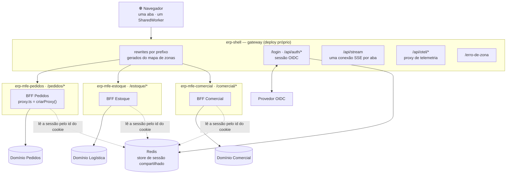
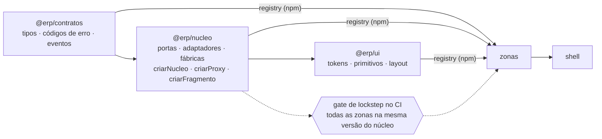
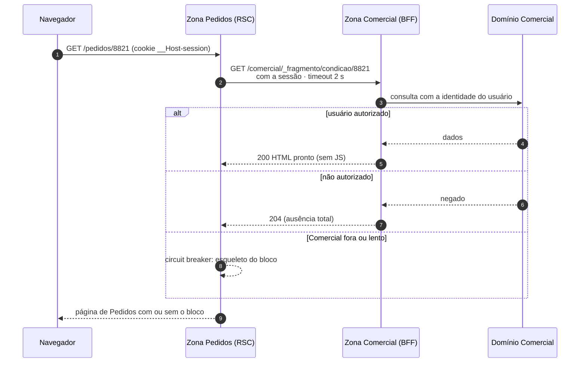
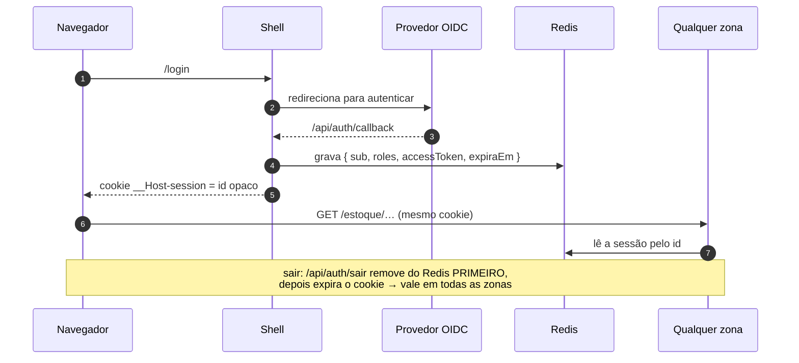
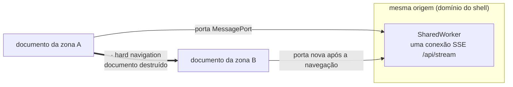

# Arquitetura alvo

> **O que isto descreve:** para onde a base deve chegar, resumido do desenho completo em
> `docs/design-bff/mfe/` (`00-arquitetura.md`, `01-operacao.md`, `02-zonas.md`). Aquele
> desenho manda; este arquivo é o mapa visual dele. O que existe hoje está em
> [`atual.md`](atual.md). A tabela do fim mostra o que falta.

A base genérica em `repos/` (ADR-0009) já tem shell, três zonas, gestão de acesso, registro de
destinos e moldura comum. O alvo é um ERP com **várias zonas de times diferentes**, cada uma com
BFF próprio e um ou mais domínios, com sessão, autorização e composição feitas no servidor.

---

## 1. Topologia

Regras que a figura carrega:

- **Uma zona fala com um domínio.** Precisando de dado de outro, pede um *fragmento* à zona
  dona (§3), que aplica a ACL dela.
- **A zona não é alcançável pelo navegador em produção.** Só existe atrás do shell.
- **O shell nunca delega** `/api/auth/*`, `/api/stream`, `/api/otel/*`, `/login`,
  `/erro-de-zona`: precisam existir mesmo com toda zona fora.

## 2. Pacotes e deploy

Ordem de publicação e deploy: **contratos → núcleo → ui → zonas → shell**. Zonas revertem
de forma independente, mas nunca abaixo do lockstep do núcleo. Contrato só cresce (janela de
depreciação de duas minors).

## 3. Composição entre zonas: `FragmentoRemoto`

- A autorização é avaliada **pelo dono do dado, antes de qualquer byte sair**.
- O `try/catch` e o timeout do fragmento são **núcleo**: sem eles, a queda do Comercial
  derruba o Pedidos.
- Nenhuma parte da URL do fragmento vem do cliente; o destino sai do mapa de zonas.

## 4. Sessão ponta a ponta

O cookie leva só um id opaco, nunca o token. Uma zona nunca implementa saída: redireciona
para a do shell.

## 5. Estado de cliente entre zonas

| O que sobrevive à troca de zona | Como |
|---|---|
| conexão SSE | `SharedWorker` na origem, multiplexando portas de documentos distintos |
| sessão | cookie `__Host-session` + Redis |
| filtro, aba, rascunho | não sobrevive, por desenho: é estado de tela |

---

## 6. Da base atual ao alvo

| Tema | Hoje (`atual.md`) | Alvo | Primeiro passo sugerido |
|---|---|---|---|
| Framework | Next 16, App Router, `proxy.ts` | igual | — |
| Zonas | shell + 3 zonas; rewrites gerados de `zonas.json` | mapa de zonas gerado dos manifestos registrados | ler prefixos e origens do domínio de gestão de acesso no boot do shell |
| Login | `identidadeDev` (4 atores, sem senha) | OIDC + PKCE | adaptador OIDC da porta de identidade |
| Store de sessão | arquivo em disco compartilhado | Redis compartilhado | adaptador `sessaoRedis` (leitor e escritor) |
| Renovação de token | não existe; sessão de dev dura 30 min | endpoint interno do shell (ADR-0009, decisão 3) | depende das respostas do IdP (PENDENCIAS §4) |
| Acesso a módulo | gestão de acesso federada, 404 para módulo negado | igual, com cache por versão de política se a medição pedir | medir a consulta por renderização |
| Falha isolada de zona | **não existe**: zona fora devolve erro do gateway | shell serve página própria (a PoC fazia 503 com `Retry-After`) | portar a sonda de vivacidade da PoC para o `proxy.ts` do shell |
| Composição | não há fragmento | `FragmentoRemoto` com timeout e circuit breaker | primeiro consumidor entre zona 1 e zona 2 |
| SSE | não há | `/api/stream` no shell + `SharedWorker` | — |
| Design system | `@erp/moldura` (moldura e toast) | `@erp/ui` publicado com semver tolerante | medir duplicação de bundle entre zonas antes |
| Deploy | local; Verdaccio local | repositórios e deploys independentes, lockstep do núcleo no CI | gate de lockstep (task 11 do plano antigo) |
| Operação | sem rate limiting nem rastreamento | rate limiting na borda, `trace_id` entre zonas | — |

Referências: `docs/design-bff/mfe/00-arquitetura.md` (solução), `01-operacao.md`
(roteamento, sessão, falha, deploy), `02-zonas.md` (estrutura e criação de zona),
`limitações-mfe-multizone.md` (as limitações que o desenho responde).
