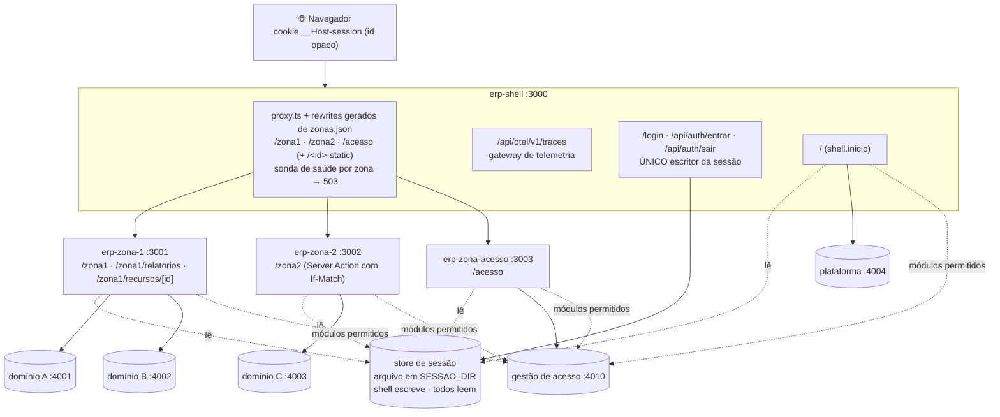
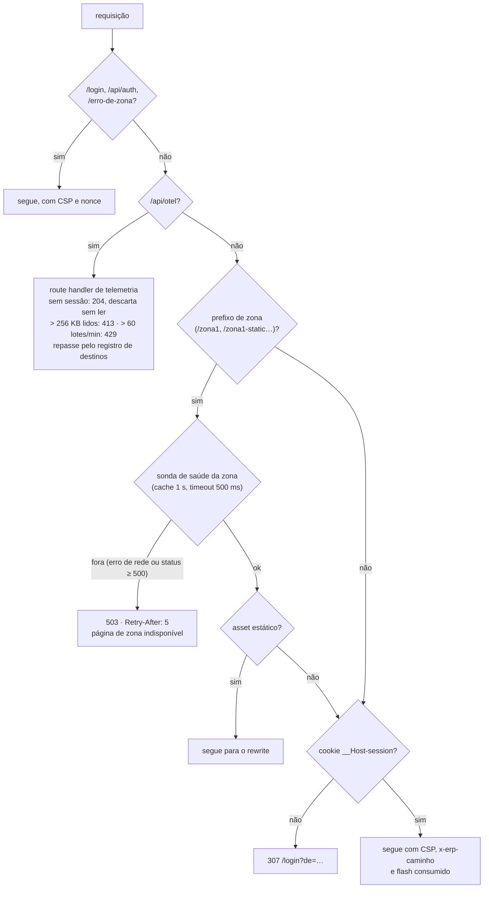
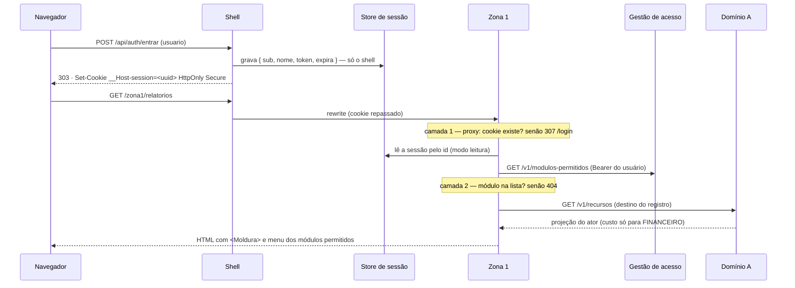
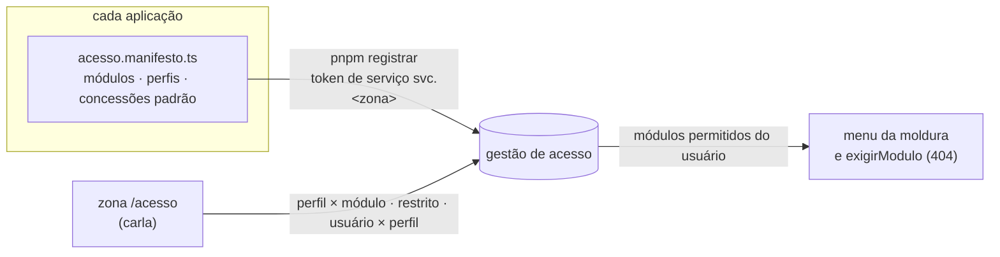
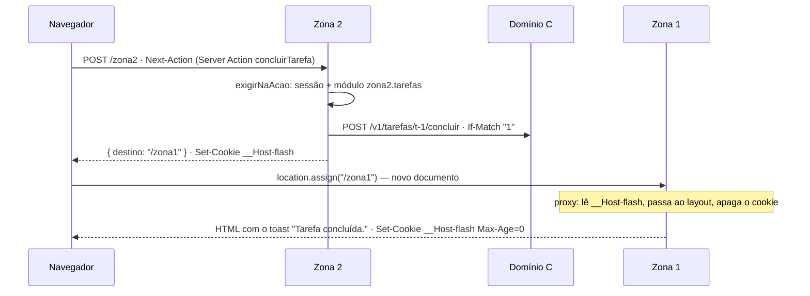

# Arquitetura atual — base genérica em `repos/`

> **O que isto descreve:** o código de `repos/` hoje, e nada além. Decisões no
> [ADR-0009](../adr/0009-base-generica.md). Para onde a base ainda vai,
> veja [`alvo.md`](alvo.md); a distância entre os dois está no fim dele. A PoC anterior (`apps/`)
> foi removida e está preservada na tag `poc-final`.

---

## 1. Visão geral

O navegador fala só com o shell (`:3000`). O shell repassa cada prefixo de zona por rewrite. Cada
aplicação tem o próprio BFF e só chama domínio pelo **registro de destinos** do `@erp/nucleo`.



Todos os domínios são falsos (`repos/erp-dominio-stub`), escutam só em `127.0.0.1` e recusam
requisição com cabeçalho de navegador (`Origin`, `Sec-Fetch-*`).

### 1.1 O que o `proxy.ts` do shell decide, em ordem

`repos/erp-shell/lib/decisao-proxy.ts` é uma função pura, testada sem o Next; o `proxy.ts` só a
traduz para `NextResponse`. Os rewrites de `next.config.ts` e a busca de zona saem do mesmo
`zonas.json`, então rota nova de zona entra nos dois de uma vez.



Escrita pelo Gabriel em 2026-09-21. O primeiro gate reprovou e a correção entrou em `erp-shell`
`f3d8803`; falta a segunda rodada de gate. O prefixo de zona é casado **sem diferenciar
maiúsculas**, como o rewrite do Next (`/ZONA2` também passa pela sonda). O caminho que o Next
entrega ao proxy já vem normalizado, e o revisor mediu que rewrite e proxy usam o mesmo parser:
a armadilha R1 da PoC não se repete aqui.

## 2. Pacotes

| Pacote | Versão | O que tem | Quem usa |
|---|---|---|---|
| `@erp/contratos` | 0.2.1 | códigos de erro e mensagens; `ManifestoDeZona`, `ModuloPermitido`, `validarManifesto` | todos |
| `@erp/nucleo` | 0.6.0 (as 4 apps) | `criarNucleo`, registro de destinos, leitores de sessão (`sessaoArquivo`, `sessaoRedis`), fragmentos (`criarFragmento`, `responderFragmento`), `acessoHttp`, `criarProxy`, `pode`; em `@erp/nucleo/shell`: `criarNucleoDoShell`, escritores de sessão, `identidadeDev` | shell e zonas (`/shell` só o shell) |
| `@erp/moldura` | 0.3.0 | `<Moldura>` (topo, menu com `aria-current`, host de toast), `emitirToast`, flash, `FormularioDeAcao` | shell e zonas |

Publicados no Verdaccio local (`:4873`). Cada aplicação é um repositório com lockfile próprio.

## 3. Uma navegação, do login ao módulo



## 4. Registro de destinos (N8)

Cada aplicação declara, em `lib/nucleo.ts`, os destinos que pode chamar:

```ts
'dominio-a': {
  origem: process.env.DOMINIO_A_URL ?? 'http://127.0.0.1:4001',
  caminhos: ['/v1/recursos', '/v1/recursos/:id'], metodos: ['GET'], credencial: 'usuario', timeoutMs: 2000,
}
```

A página chama `nucleo.destino('dominio-a').get('/v1/recursos/:id', { params: { id } })`. O núcleo:

- recusa destino, modelo ou método não declarado, **antes de qualquer chamada de rede**;
- codifica o parâmetro e recusa `.`, `..`, vazio e byte de controle;
- confere que a URL final tem a origem e o caminho esperados;
- exige `If-Match` em PUT, PATCH e DELETE;
- injeta `Authorization` e `x-erp-chamador`; nunca segue redirecionamento; aplica timeout;
- normaliza o erro para `{ codigo, supportId }`.

## 5. Gestão de acesso (N5, N6)



- Uma zona só registra o **próprio** manifesto; módulos e perfis têm o prefixo dela.
- Perfil de zona só concede módulo da própria zona; perfis globais são `plataforma.*`.
- Módulo livre: toda sessão válida vê. Módulo restrito: só perfis com concessão.
- Revogação vale na próxima navegação: os módulos são consultados a cada renderização.

| Ator | Perfis | Vê |
|---|---|---|
| ana | plataforma.usuario, zona2.operador | Início, Painel da zona 1, Tarefas |
| bruno | plataforma.usuario, zona1.analista | Início, Painel da zona 1, Relatórios; `custo` no domínio A |
| carla | plataforma.usuario, plataforma.admin-acesso | Início, Painel da zona 1, Gestão de acesso; **sem `custo`** |
| davi | — | Início, Painel da zona 1 |

## 6. Moldura e toast entre zonas (N4)

Cada aplicação renderiza `<Moldura>` com o menu que a gestão de acesso devolveu. Toast no mesmo
documento: `emitirToast({ tipo, texto })`. Toast que atravessa zona: a Server Action grava o
cookie `__Host-flash` e devolve o destino; a ilha `FormularioDeAcao` troca o documento com
`location.assign`; no documento seguinte, de qualquer zona, o **proxy consome o cookie**: entrega
o toast ao layout num cabeçalho interno e apaga o cookie na mesma resposta. Por isso o toast
aparece uma vez só, com ou sem JavaScript. A action não usa `redirect()` para outra zona: ver a limitação 11 em
`docs/desenho/mfe/infraestrutura-fora-da-vercel.md`.



## 7. O que cada teste protege

| Suíte | Comando | Protege |
|---|---|---|
| `erp-contratos` | `pnpm test` (15) | manifesto: prefixo de zona, concessão entre zonas (D8), duplicatas |
| `erp-nucleo` | `pnpm test` (107) | registro de destinos, sessão leitor/escritor (arquivo e Redis: chave com hash, TTL, erro sem vazar), fragmentos (allowlist, cookie, timeout, HTML inerte, 204/404/500), acesso, fronteira entre camadas, exports |
| `erp-moldura` | `pnpm test` (16) | menu e `aria-current`, um `<h1>`, barramento e host de toast (executado com hooks falsos), flash, `FormularioDeAcao` |
| `erp-dominio-stub` | `pnpm test` (16) | projeção e escopo do domínio A, If-Match no C, regras da gestão de acesso |
| `erp-shell` | `pnpm test` (36) | decisão do proxy (rotas públicas, telemetria, zona fora, login), prefixo de zona sem diferenciar maiúsculas, sonda de saúde com cache de 1 s, mapa de zonas e rotas reservadas, limite de tamanho em streaming e expiração do limitador |
| ponta a ponta | `node --test base/verificacao/*.test.mjs` (50, com navegador real e análise de saída de rede) | N3–N8 pelo shell, com os quatro atores; toda Server Action pelo caminho do navegador (`Next-Action`), sem `Origin`, com sessão expirada e por quem não tem o módulo; toast uma vez só; domínios derrubados um a um; gestão de acesso fora sem vazar módulo no payload; zona 2 derrubada (503 em qualquer caixa, volta) e travada (503 em < 2 s); nonce da CSP novo a cada requisição; telemetria anônima não repassada |

## 8. Quando uma peça cai (medido em 2026-09-21; verificado em `base/verificacao`)

| Cai | O usuário vê |
|---|---|
| um domínio de negócio (ex.: A) | a página abre; o bloco daquele domínio diz "indisponível no momento" |
| o domínio de gestão de acesso | a moldura sem menu e "Serviço indisponível" no HTML do servidor, sem a página: sem ele ninguém entra em módulo. O status continua 200 (o layout não o define) |
| uma zona | o shell responde 503 com `Retry-After: 5` e uma página própria, em qualquer caixa do caminho; as outras zonas seguem. **Exceção medida:** logo depois da queda, enquanto a última sonda boa vale (cache de 1 s), requisições recebem o 500 cru do Next (até ~0,8 s, challenger_shell_1). Zona travada segura a requisição ~0,6 s (timeout da sonda). Ao voltar, a zona responde de novo em 0,8–1,2 s (0,8 s se a última sonda já venceu; até 1,2 s se ainda vale; challenger_shell_1 e _2) |
| o domínio falso de gestão de acesso é reiniciado | perde manifestos e concessões (estado em memória); `pnpm registrar` em cada app os recria. O domínio real persiste |

Como rodar e conferir à mão: [`../ROTEIRO-DE-VERIFICACAO.md`](../ROTEIRO-DE-VERIFICACAO.md).
