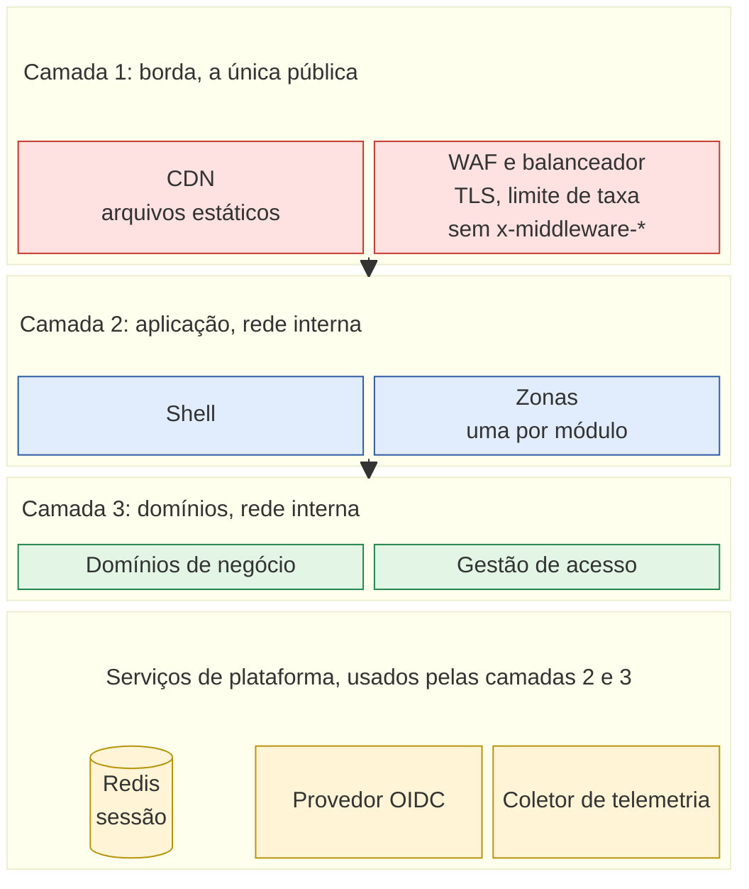
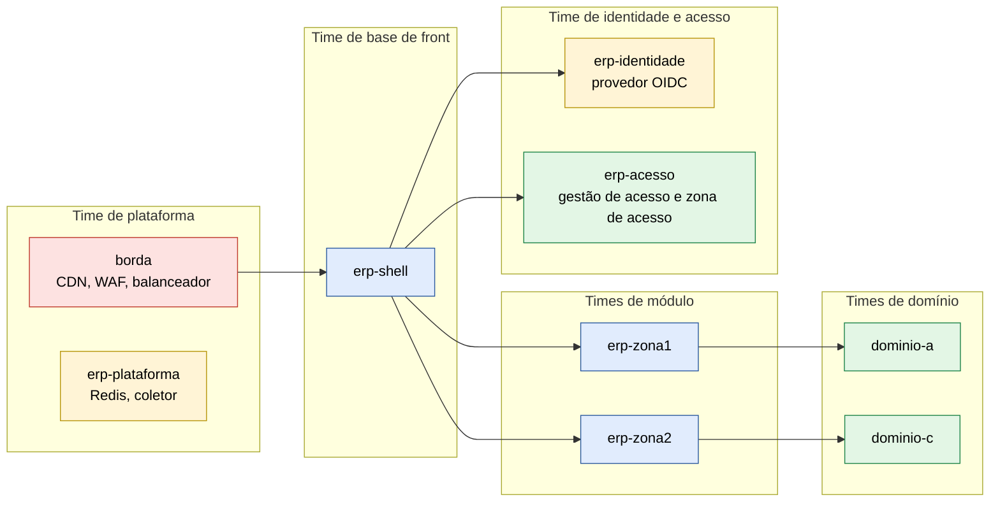
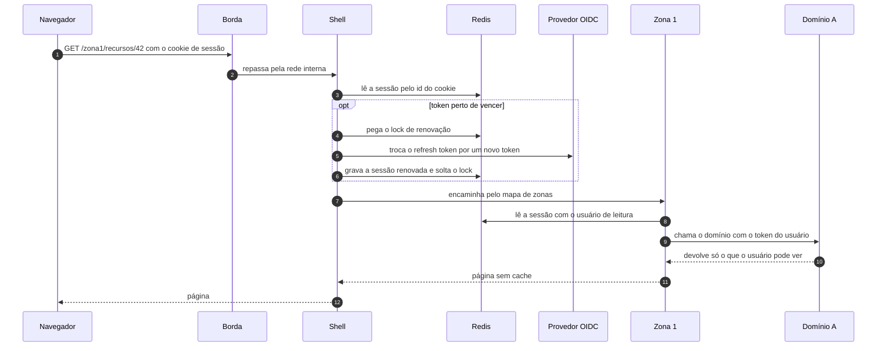
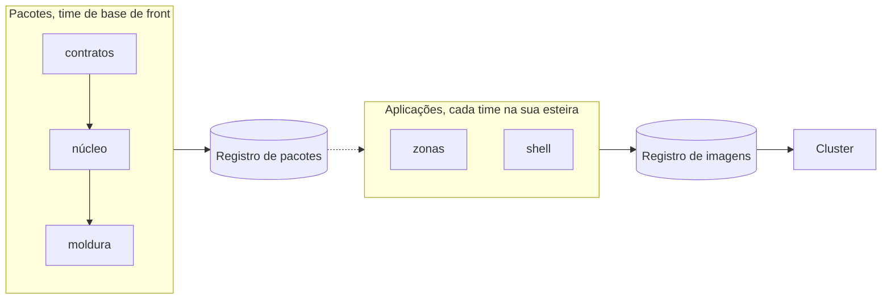

# Infraestrutura alvo

Este documento mostra os serviços que a base precisa para rodar fora da máquina de desenvolvimento, quem cuida de cada um e onde cada um roda. O funcionamento interno das aplicações está em [`alvo.md`](alvo.md), e o que existe hoje está em [`atual.md`](atual.md). O que falta para chegar ao alvo está na seção 9.

Fontes: [`infraestrutura-fora-da-vercel.md`](../desenho/mfe/infraestrutura-fora-da-vercel.md), [`01-operacao.md`](../desenho/mfe/01-operacao.md), [`07-observabilidade.md`](../desenho/bff/07-observabilidade.md), [`PENDENCIAS.md`](../desenho/bff/PENDENCIAS.md) e os ADRs 0002, 0004 e 0013.

## Como ler os diagramas

| Elemento | Significado |
|---|---|
| retângulo | processo que executa código |
| cilindro | serviço que guarda estado |
| caixa externa | camada ou fronteira de rede |
| seta contínua | chamada feita durante a requisição do usuário |
| seta tracejada | chamada fora da requisição do usuário, como telemetria ou deploy |

As cores seguem a camada: vermelho para a borda, azul para a aplicação, verde para os domínios e amarelo para os serviços de plataforma.

## 1. As camadas

A requisição do usuário atravessa três camadas, de cima para baixo, e cada camada só chama a camada logo abaixo dela. Os serviços de plataforma ficam embaixo e atendem as camadas de aplicação e de domínio; quem chama cada serviço está na seção 8.

Quatro regras sustentam esse desenho:

1. **O navegador conhece um endereço só.** Página, API e telemetria saem da mesma origem, com um certificado e um balanceador (invariante 10). O balanceador tira da resposta os cabeçalhos `x-middleware-*`: o Next anota neles a reescrita do shell com a origem interna da zona, e sem essa regra o endereço da zona chegaria ao navegador.
2. **Zona e domínio não têm porta pública.** A zona só é alcançada pelo shell, e o domínio só pela zona. Isso vira regra de firewall a cada zona nova.
3. **Só o shell grava a sessão.** As zonas leem o Redis com um usuário que só tem permissão de leitura (invariante 15).
4. **O domínio decide.** Ele valida sozinho o token do usuário com as chaves públicas do provedor OIDC e não confia no BFF para autorizar (invariante 9).

## 2. Times e responsabilidades

Cada time é dono de uma parte e a entrega sem depender da agenda dos outros. O que um time não pode mudar sozinho fica na última coluna.

| Time | É dono de | Camada | Não muda sem combinar |
|---|---|---|---|
| Plataforma | borda, cluster, rede, Redis, coletor de telemetria, registros de pacotes e de imagens, CI | borda e plataforma | as regras de rede de uma zona nova, que vêm do time da zona |
| Base de front | shell e os pacotes `@erp/nucleo`, `@erp/moldura` e `@erp/contratos` | aplicação | a versão do núcleo nas zonas, que sobe junto em todas (lockstep) |
| Identidade e acesso | provedor OIDC, gestão de acesso e a zona de acesso | plataforma, domínio e aplicação | o modelo de acesso que as outras zonas consomem |
| Um time por módulo | a zona do módulo e o catálogo de funcionalidades dela | aplicação | os contratos dos domínios que a zona chama |
| Times de domínio | os domínios de negócio e os contratos deles | domínio | a validação do token, que segue o provedor OIDC |

## 3. Onde cada parte roda

No desenvolvimento, tudo roda numa máquina só. No alvo, cada time publica no próprio namespace de um cluster, e a regra de rede entre namespaces segue a tabela da seção 8.

| Componente | Time | Desenvolvimento | Alvo |
|---|---|---|---|
| CDN, WAF e balanceador | Plataforma | não existe; o Next serve tudo | serviço gerenciado ou ingress do cluster |
| Shell | Base de front | processo Node na porta 3000 | pods no namespace `erp-shell` |
| Zonas | Time do módulo | processos Node nas portas 3001 a 3003 | pods no namespace de cada zona, como `erp-zona1` |
| Domínios de negócio | Times de domínio | domínios falsos em Node, portas 4001 a 4004 | pods no namespace de cada domínio |
| Gestão de acesso | Identidade e acesso | domínio falso, portas 4010 e 4020 | pods no namespace `erp-acesso` |
| Provedor OIDC | Identidade e acesso | contêiner Docker do Keycloak, porta 8080 | pods no namespace `erp-identidade`, com banco próprio |
| Redis | Plataforma | contêiner Docker, porta 6379 | serviço com failover no namespace `erp-plataforma` |
| Coletor de telemetria | Plataforma | não existe | pods no namespace `erp-plataforma` |
| Registro de pacotes | Plataforma | contêiner Docker do Verdaccio, porta 4873, um por máquina | um registro único |
| Registro de imagens e CI | Plataforma | não existe | serviço da plataforma de CI |

O diagrama abaixo mostra o alvo agrupado por time. Cada caixa externa é um time, e cada caixa interna é um namespace.

Para não poluir o diagrama, ele omite as ligações com o Redis e com o coletor; elas estão na seção 8.

## 4. Uma requisição, passo a passo

O caminho de `GET /zona1/recursos/42`, do navegador ao domínio.

O navegador nunca vê o token de acesso, o refresh token, nem o endereço do domínio ou do Redis. O endereço da zona também não chega a ele, com uma condição: o balanceador tira os cabeçalhos `x-middleware-*` da resposta (regra da seção 8). Sem essa regra, o caminho rápido do shell (RSC, arquivos estáticos e Server Actions) devolve `x-middleware-rewrite` com a origem interna da zona, e nenhuma configuração do Next o remove.

O shell encaminha para a zona por um mapa lido em tempo de execução da gestão de acesso, que cada zona alimenta no deploy com o registro da sua rota ([ADR-0015](../adr/0015-mapa-de-zonas-vivo-e-gateway.md)). A navegação de documento passa pelo gateway interno do shell, que entrega a página de indisponível no estouro do teto; RSC, estáticos e Server Actions vão por rewrite. O passo "encaminha pelo mapa de zonas" do diagrama não depende de build: zona nova entra em até um TTL do mapa mais uma releitura, sem republicar o shell.

## 5. Cada serviço e o que acontece se ele cair

| Serviço | O que faz | Se cair |
|---|---|---|
| CDN | entrega os arquivos estáticos com cache longo | os arquivos vêm do Node, mais devagar, e nada quebra |
| WAF e limite de taxa | barra rajadas e varreduras antes do Node | o shell recebe o pico direto |
| Balanceador | termina o TLS, repassa ao shell sem buffer nas conexões longas e tira os cabeçalhos `x-middleware-*` da resposta | nada funciona |
| Shell | login, renovação da sessão, encaminhamento às zonas, página de zona fora do ar | nada funciona |
| Zonas | cada uma renderiza o seu módulo e chama os seus domínios | só aquela zona mostra a página de indisponível |
| Redis | guarda a sessão, a transação de login e o lock de renovação | ninguém se autentica, de propósito |
| Provedor OIDC | login, emissão e renovação de token, chaves públicas | quem já entrou segue até o token vencer, e ninguém novo entra |
| Domínios | regra de negócio e autorização final | só as telas que dependem dele mostram erro |
| Gestão de acesso | módulos, acesso efetivo e eventos de acesso | o menu some e ninguém entra em módulo |
| Coletor de telemetria | recebe os traces do shell e das zonas | perde-se observação, não funcionalidade |

## 6. Sessão no Redis

Uma instância, com `noeviction`, para que nenhuma sessão seja descartada por falta de memória, e com AOF, para sobreviver a um reinício. No alvo, com failover e TLS.

| Chave | Quem grava | Quem lê | Para quê |
|---|---|---|---|
| `erp:sessao:{id}` | shell | shell e zonas | o cookie leva só o id, e o token fica no servidor |
| `erp:login:{id}` | shell | shell | a transação de login vale uma vez só |
| `erp:renovacao:{id}` | shell | shell | evita que duas réplicas renovem ao mesmo tempo, o que faria o provedor revogar a sessão |
| canal `sse:user:{sub}` | domínios | shell | avisa a aba aberta numa réplica que algo mudou; entra com o item C2 |

O Redis precisa estar na mesma rede de todas as zonas. Uma zona publicada sem acesso a ele trata todo usuário como deslogado.

## 7. Telemetria e entrega

**Telemetria.** O navegador nunca fala com o coletor. Ele envia os traces ao shell, que exige sessão, limita o volume e repassa. O shell e as zonas propagam o `traceparent` até o domínio. Nenhum span leva cookie, token ou dado pessoal.

**Entrega.** Cada repositório tem a própria esteira. A ordem de publicação segue a dependência entre as partes.

A ordem é contratos, núcleo, moldura, zonas e por fim o shell, que passa a rotear para a zona nova. Uma zona volta de versão sozinha, mas nunca abaixo da versão do núcleo em uso por todas. Cada aplicação vira uma imagem com `output: 'standalone'` e usa `/{zona}/api/health` como sonda de vida, sem chamar o domínio.

## 8. Regras de rede

Esta tabela é a regra de firewall. O que não está nela fica bloqueado.

| De | Para | Credencial | Observação |
|---|---|---|---|
| internet | CDN e balanceador | cookie de sessão | as únicas portas públicas |
| balanceador | shell | repassa o cookie | conexões longas sem buffer |
| balanceador | internet (resposta) | nenhuma | remove os cabeçalhos `x-middleware-*`, que trazem a origem interna da zona (ADR-0015, adendo) |
| shell | zonas | repassa o cookie | o destino vem do mapa de zonas, nunca de um cabeçalho |
| shell | provedor OIDC | segredo do cliente do shell | login, token e logout |
| shell | Redis | usuário com escrita | lê e grava a sessão |
| zonas | Redis | usuário só de leitura | lê `erp:sessao:*` |
| shell e zonas | domínios | token do usuário | só pelo registro de destinos (invariante 4) |
| domínios | provedor OIDC | nenhuma | só as chaves públicas |
| domínios | Redis | usuário só de publicação | entra com o item C2 |
| shell e zonas | coletor | nenhuma | spans sem dado pessoal |
| CI | registros | token de publicação | fora da requisição do usuário |

Zona e domínio ficam na mesma rede, com latência perto de 1 ms. Um alarme acima de 5 ms por par avisa quando o modelo de desempenho deixa de valer ([`08-desempenho.md`](../desenho/bff/08-desempenho.md)).

## 9. Hoje e alvo

| Serviço | Hoje, numa máquina | Alvo | Falta |
|---|---|---|---|
| CDN | não existe | CDN na frente dos arquivos estáticos | escolher e configurar |
| WAF e limite de taxa | só o limite da rota de telemetria | na borda, por IP e por sessão | desenho (`01-operacao.md` §8.3) |
| Balanceador e TLS | HTTP em `localhost`; o shell devolve `x-middleware-rewrite` com a origem interna da zona no caminho rápido (limite declarado, D31) | um certificado, uma origem e a remoção de `x-middleware-*` na resposta | escolher o proxy e escrever as regras |
| Rede interna | tudo em `127.0.0.1` | namespaces por time, sem rota da internet | regras de rede por namespace |
| Redis | contêiner único com `noeviction`, AOF e os dois usuários | o mesmo, com failover e TLS | teste de failover durante a renovação |
| Avisos em tempo real | não existe | canal por usuário no Redis | item C2 do plano |
| Provedor OIDC | Keycloak em modo de desenvolvimento, HTTP local | Keycloak ou outro OIDC com HTTPS | só configuração |
| Gestão de acesso | domínio falso com estado em JSON | domínio real e persistente | fora do escopo da base |
| Telemetria | o `traceparent` já se propaga, sem coletor | coletor e backend de traces | item B2 do plano |
| Registro de pacotes | um Verdaccio por máquina | um registro único | item P1, no fim do plano |
| CI | verificação no `pre-push` local | a mesma verificação no CI de cada repositório | quando houver CI |
| Imagens | `next start` local | imagem `standalone` por aplicação | escrever as imagens |
