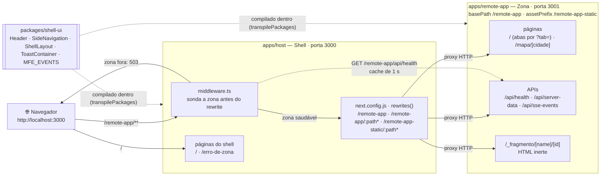
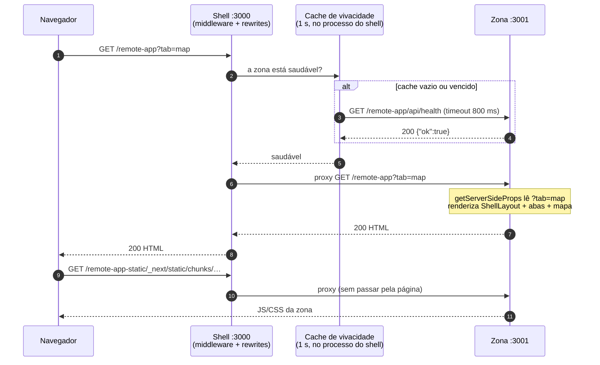
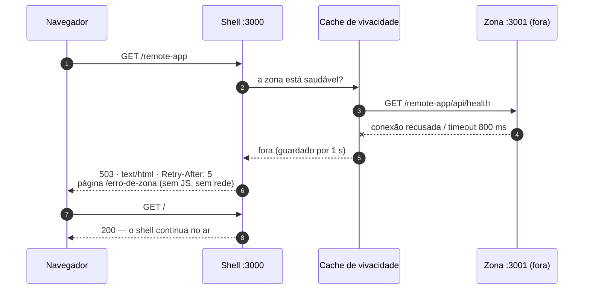
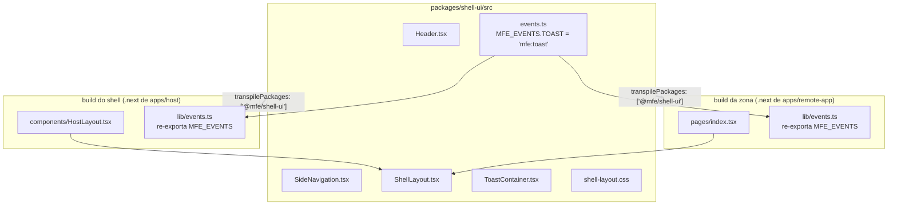
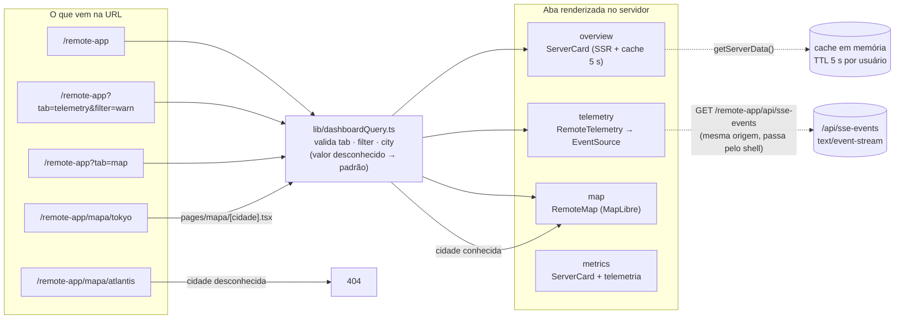
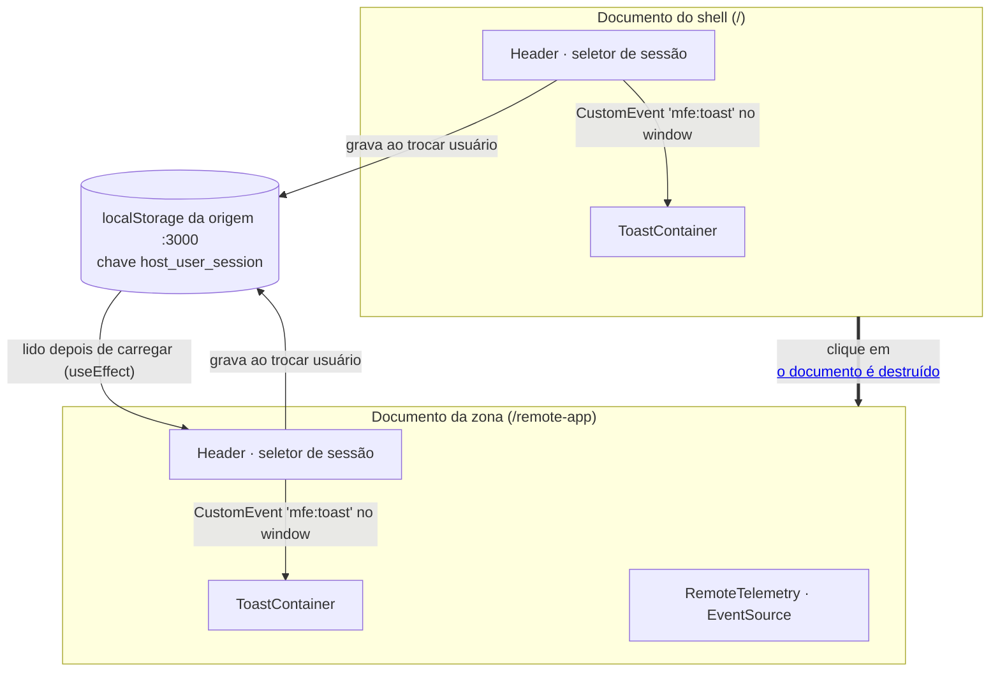
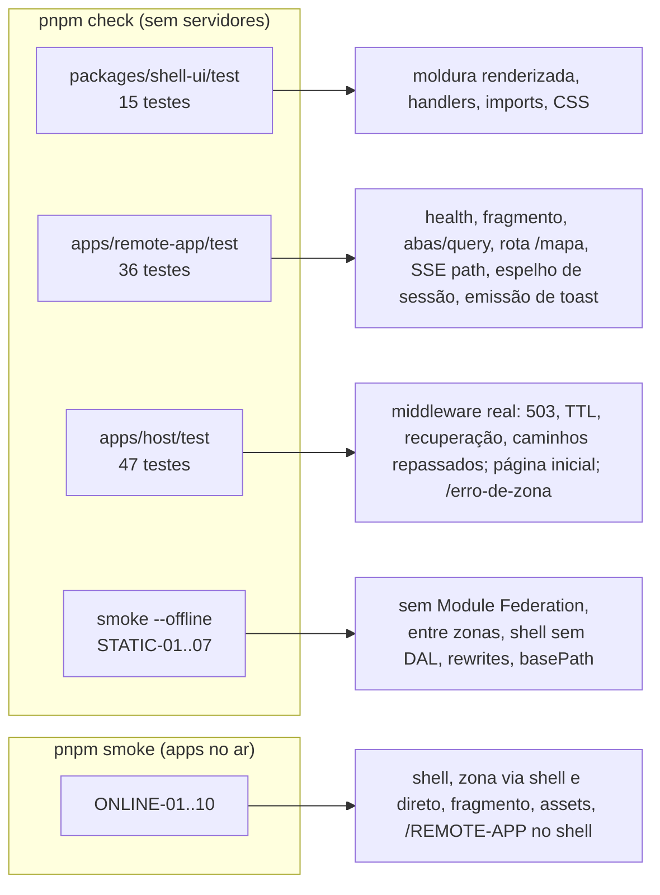

# PoC `apps/` — congelada em 2026-09-21

> **Histórico.** Esta é a arquitetura da prova de conceito em `apps/` (Pages Router), congelada
> pelo [ADR-0009](../design-bff/comum/docs/adr/0009-base-generica.md). A base que vale hoje está
> em [`atual.md`](atual.md). O documento fica porque os testes da PoC continuam rodando e as
> lições (queda isolada, janela da sonda) valem para a base nova.
>
> Diagramas em Mermaid: o GitHub e a maioria dos editores os renderizam direto.

---

## 1. Visão geral

Dois processos Next.js independentes e um pacote de código-fonte compartilhado. O navegador
só conversa com o **shell**; o shell repassa por HTTP tudo o que é da **zona**.

| Peça | Responsabilidade | Não faz |
|---|---|---|
| **Shell** (`apps/host`) | Porta de entrada; página inicial; repassa `/remote-app/**` à zona; responde a queda da zona com `/erro-de-zona` | Não acessa dados de domínio (sem DAL); não renderiza nada da zona |
| **Zona** (`apps/remote-app`) | Painel com SSR, abas por query, rota de caminho, SSE, mapa, cache de servidor, fragmento, health | Não conhece o shell; só sabe que vive sob `/remote-app` |
| **`@mfe/shell-ui`** | A moldura visual idêntica nas duas apps e o nome dos eventos entre elas | Não é carregado em runtime: é código-fonte compilado separadamente em cada app |

---

## 2. Um pedido com a zona no ar

Pontos que o diagrama mostra e que costumam surpreender:

- **O navegador nunca vê a porta 3001.** Assets da zona saem por `/remote-app-static/…`,
  não por `/_next/…`, porque as duas apps teriam `/_next` e colidiriam.
- **O middleware não olha o caminho.** Quem decide se o pedido é da zona é o `matcher`
  (os mesmos três literais dos rewrites). Olhar `request.nextUrl.pathname` já deixou pedidos
  como `/remote-app/..` chegarem à zona morta sem sonda; há teste que proíbe ler a requisição.
- **Rotas diferenciam maiúsculas** (`experimental.caseSensitiveRoutes`): `/REMOTE-APP` fica
  no shell e recebe 404.

## 3. Um pedido com a zona fora

**Exceções medidas** (detalhe em `docs/design-bff/mfe/01-operacao.md` §5.1):

| Situação | O que acontece |
|---|---|
| Até ~1 s depois de a zona **cair** | o cache ainda diz "saudável": o pedido vai à zona e volta 500 cru do Next |
| Zona **travada** (processo vivo, sem resposta) dentro dessa janela | o pedido espera o timeout do proxy do Next (30 s) e recebe 500 |
| Zona travada fora da janela | a cada expiração do cache, quem chega espera o resto da sonda (até 800 ms) e recebe 503 |
| Zona sobe de novo | a primeira resposta 200 vem em ~1 s |

---

## 4. Como a moldura é compartilhada

Não há Module Federation nem bundle compartilhado em runtime. O pacote é **código-fonte**,
e cada app o compila no próprio build.

Consequências práticas:

- **Mudou a moldura? Rebuild das duas apps.** Cada uma leva uma cópia compilada.
- **O nome dos eventos tem uma definição só** (`events.ts`). Emissor e ouvinte não podem
  divergir sem um teste falhar.
- **Custo:** no primeiro salto shell → zona o navegador baixa de novo o framework do React
  (~45 kB gzip), porque o cache do navegador é por URL e cada app serve o seu.
- **Diferença visual conhecida (D11):** `apps/host/styles/globals.css` ainda redefine parte
  das classes da moldura, então o espaçamento difere entre shell e zona.

---

## 5. O que acontece dentro da zona

- **Troca de aba é navegação de documento** (`<a>` comum): o servidor relê a query e
  renderiza de novo. Nada de estado de aba no cliente.
- **SSE usa caminho com `basePath`** (`/remote-app/api/sse-events`): funciona pelo shell e
  direto na zona. Sem o prefixo, o pedido cairia no 404.
- **Mapa**: o motor MapLibre carrega no navegador; os ladrilhos vêm de
  `tile.openstreetmap.org` (precisa de internet).

---

## 6. Estado entre as páginas

| Estado | Como vive hoje | Limite |
|---|---|---|
| **Sessão** | espelhada no `localStorage` da origem do shell | só no cliente e depois do carregamento; o HTML do servidor mostra sempre o usuário padrão (D3) |
| **Toast** | `CustomEvent` no `window` do documento atual | não atravessa navegação (nem deve) |
| **SSE** | um `EventSource` por documento | cai a cada troca de zona; o servidor não libera o intervalo quando o cliente sai (D1) |
| **Cache de servidor** | `Map` em memória na zona, 5 s | por processo; some ao reiniciar |
| **Aba, filtro, cidade** | na URL | é estado de tela: não precisa sobreviver |

---

## 7. O que cada teste protege

Fora da cobertura automática: o que roda só em `useEffect` no navegador (leitura do
`localStorage`, assinatura do toast, abertura do `EventSource`, motor do mapa) — D9/D10.
Esses itens estão no [roteiro de verificação manual](../ROTEIRO-DE-VERIFICACAO.md).
