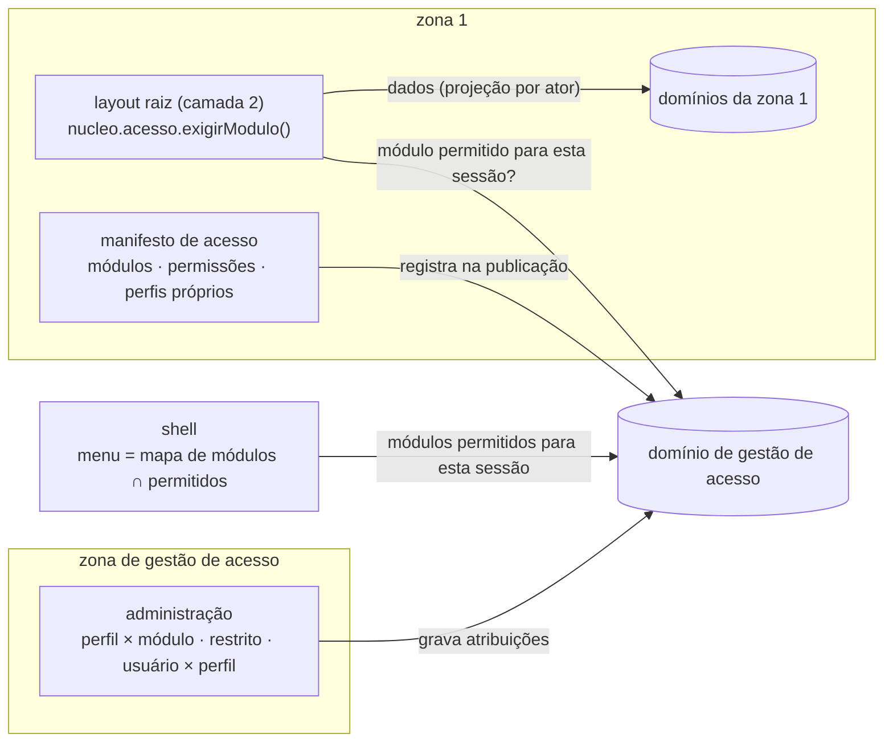
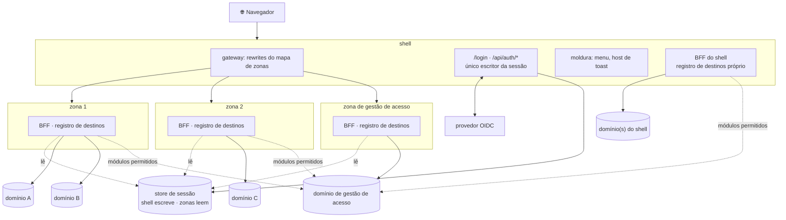
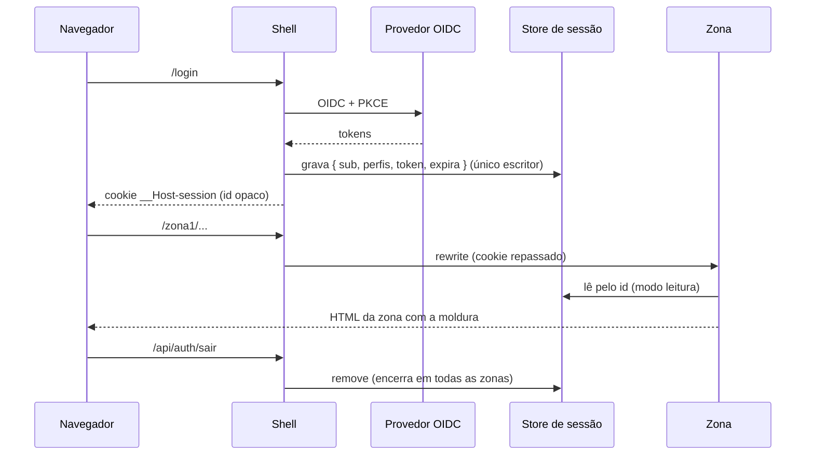
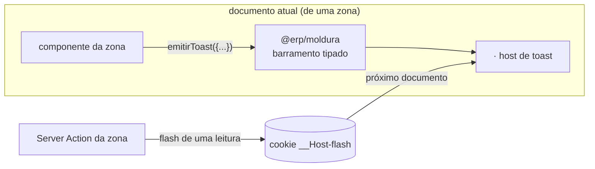

# Revisão — documentação, specs, validadores e harness contra o objetivo de base genérica

## 0. Resumo

**O objetivo, reformulado pelo humano em 2026-09-15:** validar uma arquitetura **BFF com
Multi-Zones, com funcionalidades**. O caso de uso serve de ilustração. As camadas e o código
da base **não podem ser específicos de um domínio**.

**Veredito.** O desenho de segurança do BFF continua sólido e deve ser mantido: token fora do
navegador, projeção no domínio, erro normalizado, `server-only`, allowlist de saída, regra
núcleo × extensão. Mas a base foi escrita **para um caso**, e isso aparece em quatro lugares
que conflitam com o objetivo:

1. **O caso virou critério de aceite.** O ADR-0008 decisão 10 diz que a base é construída
   para o caso `/pedidos/8821`, "não para um domínio hipotético". Os agentes validadores, a
   spec e o plano herdaram isso.
2. **A topologia é rígida.** "Uma zona fala com **um** domínio" e "o shell não fala com
   nenhum domínio". O objetivo pede uma ou mais aplicações de domínio por zona **e** no shell.
3. **O código do núcleo conhece o domínio.** `PortaDeDados.lerPedido()`, `dadosHttp` montando
   `/pedidos/…`, `@erp/nucleo` dependendo de `PedidoDTO`, e um único `API_BASE_URL`.
4. **Faltam três peças do objetivo:** a zona de gestão de acesso (perfil × módulo, módulo
   restrito, submódulo por zona), o contrato de comunicação shell ↔ zonas (toast global) e o
   papel do shell como provedor de sessão consumida pelas zonas.

**Recomendação.** Pausar a Task 8 como está especificada: ela construiria o shell e a zona em
cima do núcleo acoplado. Antes, decidir os pontos da §7, registrar um ADR-0009 ("base
genérica") que substitui a decisão 10 do ADR-0008, e replanejar a fatia 1.

---

## 1. O objetivo, como requisitos verificáveis

| # | Requisito | Origem |
|---|---|---|
| N1 | A base valida **BFF + Multi-Zones com funcionalidades**; o caso é só ilustração | humano, 2026-09-15 |
| N2 | Topologia mínima: **shell, zona 1, zona 2, zona de gestão de acesso** | idem |
| N3 | **Sessão e autenticação pelo shell**; as zonas consomem essa sessão | idem |
| N4 | **Shell ↔ zonas se comunicam no cliente**: o toast global é do shell, e as zonas disparam toasts que caem no componente dele | idem |
| N5 | A zona de gestão de acesso define **qual perfil acessa qual módulo** e se um **módulo é restrito** por perfil | idem |
| N6 | **Cada zona tem o próprio submódulo de gestão de acesso**: declara as próprias permissões e perfis, inclusive perfis específicos dela. São sistemas separados, mas integrados | idem |
| N7 | **Cada zona tem uma ou mais aplicações de domínio**, diferentes entre zonas; **o shell também** pode ter uma ou mais | idem |
| N8 | **Núcleo flexível** (pacote e/ou middleware), sem código de domínio específico. Os destinos vêm de cada domínio, mas **travados no servidor, como um CORS de saída** | idem |

---

## 2. O que foi lido

| Grupo | Arquivos |
|---|---|
| Base BFF | `docs/design-bff/comum/AGENTS.md`, `docs/00-caso.md`, `01-camadas.md`, `02-nucleo.md`, `04-servicos.md` (§1–2), `06-seguranca.md` (§1–2, §5), `11-testes.md` (§1), ADR-0008, índice de `03`, `09`, `PENDENCIAS` |
| MFE | `docs/design-bff/mfe/00-arquitetura.md`, `01-operacao.md`, `02-zonas.md`, índices de `multizone.md`, `limitações-mfe-multizone.md`, `ideia-mfe` |
| Spec e plano | `docs/superpowers/specs/2026-09-09-base-mfe-multizone-design.md`, plano da fatia 1 (Tasks 1–11, contagem de acoplamento), `ESTADO.md` |
| Validadores | `.claude/agents/arquiteto-mfe.md`, `revisor-mfe.md`, `testes-invariantes.md`, `simulador-condicoes.md` |
| Harness | `.agents/orchestrator/` (`RETOMADA`, `BRIEFING`, `PROJECT`, `GATE_STATUS`, `DEFERRED`, `MANUTENCAO-GITLAB`), `ORIGINAL_REQUEST.md`, `POC.md` |
| Trilha PoC | `README.md`, `docs/arquitetura/atual.md`, `alvo.md`, `docs/ROTEIRO-DE-VERIFICACAO.md` |
| Código | `repos/erp-nucleo/src/**`, `repos/erp-contratos/src/**`, `repos/erp-dominio-stub/**` |

Termos do caso (`pedido`, `8821`, os quatro atores, `CondicaoComercial`), em número de
linhas: plano da fatia 1 **289**, `06-seguranca` 40, `00-caso` 37, spec 27, `04-servicos` 24,
`mfe/00-arquitetura` 21, `02-nucleo` 20; no código do núcleo, `dados-http.ts` 8 e
`testing/index.ts` 9.

---

## 3. O que continua válido e deve ficar

Nada do que segue precisa mudar de natureza. Muda só a redação, que hoje usa o caso como
exemplo obrigatório.

| Decisão | Onde está | Por que fica |
|---|---|---|
| Três camadas (cliente, BFF, domínio) e autoridade por camada | `01-camadas.md` §1–2 | é o que torna o BFF seguro, independente do domínio |
| Teste núcleo × extensão ("desligue o componente") | `AGENTS.md`, `02-nucleo.md` §1 | critério genérico e já provado útil (ADR-0007) |
| Token e credencial só no servidor; cookie opaco | invariantes 1, 11; `06-seguranca.md` §5 | independe de caso |
| Projeção e autorização **de dados** no domínio | invariante 9; `01-camadas.md` §5 | continua valendo para cada domínio de cada zona |
| Erro normalizado `{ codigo, supportId }` | invariante 12 | contrato transversal |
| `server-only` como fronteira de build | invariante 3 | idem |
| Allowlist de saída, sem destino vindo da requisição | invariante 4, RFC 10017 | **fica, mas generalizada** (§4.D) |
| Critério `401` × `403` × `404` | `06-seguranca.md` §2 | genérico |
| Fragmento entre zonas (HTML inerte, `204` uniforme, timeout e breaker) | `02-zonas.md` §2, `00-arquitetura.md` §6 | genérico |
| Limitações do Multi-Zones (hard navigation, `<a>` entre zonas, `assetPrefix`, rotas reservadas do shell) | `mfe/multizone.md`, `01-operacao.md` §1 | propriedades do framework |
| Queda de zona isolada (sonda + 503 + `/erro-de-zona`) | `01-operacao.md` §5.1, PoC | medido e aprovado |
| Lockstep do núcleo, multi-repo, Verdaccio | ADR-0008 dec. 2–3, spec §7 | independe de caso |
| Separação entre quem decide e quem revisa (agentes, auditor forense com veto) | spec §10, `.agents/` | provou valor (gates M2 e final) |

---

## 4. Achados

Severidade em relação ao **novo objetivo**:
- **B (bloqueante):** contradiz N1–N8, e construir em cima propaga o erro;
- **I (importante):** incompleto ou ambíguo;
- **M (menor):** estado desatualizado.

### A. O caso virou critério de aceite (B)

| Onde | O que diz | Conflito |
|---|---|---|
| `adr/0008-multi-zones-como-base-mfe.md:31` (decisão 10) | "O caso de `00-caso.md` é o alvo funcional… a base é construída para atendê-lo, não para um domínio hipotético" | oposto de N1 |
| `mfe/00-arquitetura.md:16` | "Ele não é ilustração — é o critério de aceite" | idem |
| spec §5.1 e §9 | critério de pronto = C1 e C7 com os quatro atores em `/pedidos/8821` | a base só "passa" se implementar o caso |
| `.claude/agents/testes-invariantes.md:32` | "O caso é o alvo"; toda verificação roda contra os quatro atores | o validador exige o caso |
| `AGENTS.md` (Casos 1–3, exemplos) e `02-nucleo.md` §2.3–2.5 | exemplos com `getPedido`, `lib/pedidos/dal.ts`, `/pedidos/${id}` | inofensivo como exemplo, mas lido como molde |

**Proposta.**
1. `00-caso.md` passa a ser **exemplo**, com aviso no topo.
2. O critério de aceite vira um conjunto de **capacidades da arquitetura**, cada uma com cenário genérico:
   - projeção por ator;
   - `404` neutro;
   - acesso a módulo negado;
   - toast de zona no shell;
   - queda de zona;
   - fragmento degradado.
3. A implementação de referência usa domínios de exemplo, e os testes são **parametrizados pelo manifesto** da zona (§5.4), não por `pedido`.

### B. Topologia rígida: um domínio por zona, shell sem domínio (B)

| Onde | O que diz | Conflito |
|---|---|---|
| `mfe/00-arquitetura.md:71` | "Cada zona… falando com **um** domínio" | N7 |
| `mfe/02-zonas.md:61-63` | "O shell não tem DAL… não fala com nenhum domínio" | N7 (o shell pode ter domínios) |
| `docs/arquitetura/alvo.md:56` | "Uma zona fala com um domínio" | N7 |
| `AGENTS.md:63` (invariante 4) | valida o destino contra **`API_BASE_URL`** (uma origem) | N7, N8 |

**Proposta.**
- **Zona e shell falam só com os domínios declarados no próprio registro de destinos** (§4.D).
- A regra que protege a autoridade continua, reescrita: **uma zona não chama domínio declarado por outra zona**. Precisando de dado alheio, pede fragmento.
- O shell pode ter domínios **próprios de plataforma** (identidade, catálogo de módulos, notificações). O que ele não pode é ler dado de negócio de uma zona: continua pedindo fragmento.
- A frase "vira uma quarta zona disfarçada" (`02-zonas.md` §1.2) passa a valer para **dado de negócio**, não para qualquer domínio.

### C. Núcleo e contratos com código de domínio (B)

| Onde | O que é | Conflito |
|---|---|---|
| `repos/erp-nucleo/src/portas/dados.ts:10` | `lerPedido(id): Promise<{ pedido: PedidoDTO }>` | a porta genérica conhece o recurso "pedido" |
| `repos/erp-nucleo/src/adaptadores/dados-http.ts` | monta `/pedidos/${encodeURIComponent(id)}` e trata `.`/`..` do id do pedido | caminho do domínio dentro do pacote transversal |
| `repos/erp-nucleo/src/testing/index.ts` | `dadosFake(pedidos: Record<string, PedidoDTO>)` | idem |
| `repos/erp-nucleo/package.json:18` | depende de `@erp/contratos`, que exporta `pedido.ts` | publicar o núcleo arrasta o DTO de um domínio |
| `repos/erp-contratos/src/pedido.ts` | `PedidoDTO`, `ACOES_PEDIDO`, `CondicaoComercial` | contrato de **um** domínio num pacote de **plataforma** |
| spec §4.3, plano Tasks 8–9 | `lib/nucleo.ts` com `dadosHttp({ baseUrl })` e `nucleo.dados.lerPedido(id)` na página | reproduz o acoplamento nas apps |

**Proposta** (detalhe em §5.2):
- o núcleo expõe **transporte genérico por destino nomeado**, não métodos de recurso;
- **código de domínio mora na zona** (`lib/{dominio}/dal.ts`), como os documentos-base já dizem em `04-servicos.md` §2.3 (o `upstream` "não sabe o que é um pedido");
- `@erp/contratos` fica só com o transversal: erros, sessão pública, eventos da moldura e formato do manifesto de acesso;
- DTOs de domínio vão para pacotes do time dono (`@erp/contratos-{dominio}`) ou ficam locais na zona.

**Nota:** a proteção contra `.`/`..` e a codificação do identificador **continuam**, só que genéricas: o núcleo codifica todo parâmetro de caminho de modelo (`/v1/itens/:id`) e recusa segmentos de ponto em qualquer destino.

### D. Allowlist de saída é uma origem só; falta o "CORS de saída" (B)

Hoje a garantia do elemento 7 é "o destino tem a mesma origem que `API_BASE_URL`". Com vários
domínios por zona (N7), a pergunta vira: **para quais destinos, quais caminhos e quais métodos
esta aplicação pode sair?** Essa é a forma pedida em N8.

**Proposta: registro de destinos**, declarado no servidor e validado na subida:

| Campo | Exemplo | Regra |
|---|---|---|
| nome | `catalogo` | a zona só chama por nome |
| origem | `env.DOMINIO_CATALOGO_URL` | só de variável de ambiente; nunca de cabeçalho (`01-operacao.md` §2.2) |
| caminhos permitidos | `/v1/itens/:id`, `/v1/itens` | modelos; parâmetros sempre codificados pelo núcleo |
| métodos | `GET` (rodada 1) | trava estrutural da escrita |
| credencial | `usuario` (Bearer da sessão) · `servico` · `troca-de-token` | define o que vai no `Authorization` |
| cabeçalho de chamador | segredo de dev/serviço (decisão da invariante 3) | só o núcleo injeta |
| timeout | `2000` | obrigatório |

Resultado:
- `upstream()` continua inalcançável, e a zona não tem como montar URL;
- um destino fora do registro, um caminho fora do modelo ou um método não declarado lançam `DestinoInvalido`;
- é o elemento 7 generalizado, com o mesmo teste (`//evil.com`, TAB, `..`) aplicado a cada destino.

### E. Sessão e autenticação pelo shell: bem encaminhada, com dois buracos (I)

Os documentos já põem `/login` e `/api/auth/*` no shell e a sessão num store compartilhado
(`01-operacao.md` §3). Isso atende N3. Faltam duas coisas:

1. **Quem escreve e quem lê.** Nada impede uma zona de gravar ou apagar sessão no store.
   Proposta: o shell é o **único escritor**; as zonas usam o adaptador de sessão em **modo
   leitura** (credencial do Redis com ACL só de leitura), e o núcleo não expõe `gravar`
   nem `remover` para zonas.
2. **Renovação do token** (`PENDENCIAS §4`, aberta). Com o shell como único escritor, a zona
   não pode renovar sozinha. Opções:
   - a zona pede ao shell por um endpoint interno, fora do alcance do navegador;
   - o shell renova antes de expirar.

   Depende do IdP (§7, D3).

**A sessão que a zona enxerga precisa crescer para N5–N6.** Hoje é `{ sub, roles }`, e grupos
nunca entram (`02-nucleo.md:95`, `01-operacao.md` §3.2). Para decidir acesso a módulo, a zona
precisa perguntar ao domínio de acesso (§4.G), não ler da sessão. A regra "grupos não ficam
na sessão" continua.

### F. Comunicação shell ↔ zonas no cliente: não há contrato (B para N4)

**O fato de framework que decide:** no Multi-Zones, cada documento é de **uma** aplicação.
Quando o usuário está em `/zona1`, o documento é da zona 1, e **o código da aplicação shell
não está carregado nele**. "O componente de toast do shell" só existe no documento da zona se
a zona o renderizar.

A PoC resolveu assim: o pacote `@mfe/shell-ui` (moldura + `ToastContainer`) é renderizado por
cada app, com `CustomEvent('mfe:toast')` e o nome do evento numa constante única
(`docs/arquitetura/atual.md` §4, §6). Isso funciona, mas não está nos documentos-base: o
`mfe/00-arquitetura.md` §7 fala só de SSE, sessão e estado de tela.

**Proposta: contrato da moldura**, como pacote de plataforma (`@erp/moldura`, ou dentro de `@erp/ui`):

| Peça | Dono | Regra |
|---|---|---|
| `<Moldura>` (cabeçalho, navegação, **host de toast**) | plataforma | todo root layout de zona e do shell a renderiza; zona não reimplementa |
| `emitirToast({ tipo, mensagem, duracao? })` | plataforma | única API de disparo; tipada; o nome do evento não aparece em código de zona |
| Toast que precisa sobreviver à navegação (ex.: "salvo" e depois redireciona) | plataforma | *flash* de uma leitura só: cookie `__Host-flash` gravado no servidor, ou `sessionStorage`, lido pela moldura no próximo documento |
| Toast entre abas | extensão | `BroadcastChannel`; se desligar, cada aba vê só os próprios |
| Menu | plataforma | montado no **servidor** a partir do mapa de módulos ∩ módulos permitidos (§4.G), nunca de `roles` no cliente |

Se "o componente principal fica no shell" precisar ser **literalmente** o runtime do shell
(uma cópia só, sem rebuild das zonas), as saídas são:
- Module Federation **restrito à moldura**, que é a mesma exceção já avaliada em `00-arquitetura.md` §12.1;
- ou `<iframe>`, que eu não recomendo.

Decisão em §7, D4.

### G. Gestão de acesso: ausente, e colide com três regras atuais (B para N5, N6)

Não há nenhuma menção a perfil × módulo, módulo restrito ou submódulo de acesso por zona. A
busca por `perfil|módulo restrito|gestão de acesso|rbac` não achou nada relevante. E três
regras atuais precisam ser reescritas para caber:

| Regra atual | Onde | Conflito com N5/N6 | Reescrita proposta |
|---|---|---|---|
| "Autorização só no domínio"; "o BFF não é camada de autorização" | invariante 9; `01-camadas.md` §2 | acesso a módulo é autorização, e a decisão precisa acontecer antes de renderizar | **a decisão é de um domínio** (o domínio de gestão de acesso); shell e zonas **aplicam** a decisão sem calculá-la. Autorização **de dados** continua em cada domínio de dados |
| `roles` montam o menu, "decisão do cliente sobre si mesmo" | `02-nucleo.md:95`; `01-operacao.md:160` | o menu passa a depender de perfil × módulo, definido na gestão de acesso | o menu é montado no servidor com a lista de módulos permitidos devolvida pelo domínio de acesso; `roles` deixam de ser insumo de menu |
| A camada 1 (`proxy.ts`) faz zero I/O | `00-arquitetura.md:361`; `06-seguranca.md` §2 | a verificação de módulo precisa de I/O | a verificação de módulo fica na **camada 2** (layout raiz da zona, no servidor), não no `proxy.ts`; a regra de zero I/O continua |

**Modelo proposto.** Há duas granularidades, cada uma com um dono:

| Nível | Pergunta | Quem decide | Quem aplica | Resposta ao negar |
|---|---|---|---|---|
| **Módulo** | "este perfil entra neste módulo?" | domínio de **gestão de acesso** | shell (menu) e zona (layout raiz, camada 2) | `404` do módulo (a existência do módulo restrito é segredo) ou `403` se o módulo é público na navegação: decisão D6 |
| **Recurso/ação** | "este usuário vê este registro / pode esta ação?" | **domínio de dados** da zona | a zona só renderiza o que veio e usa `_permissoes` para a interface | `404` / `403`, como hoje |

**Submódulo de acesso por zona (N6).** Cada zona publica um **manifesto de acesso**,
versionado com o código da zona:
- os **módulos** que ela serve (prefixos de rota), cada um com a marca "restrito" padrão;
- as **permissões** que ela entende;
- os **perfis próprios** da zona e as permissões de cada um.

O domínio de gestão de acesso **registra** os manifestos, e a zona de gestão de acesso é a
**interface de administração**:
- quais perfis entram em quais módulos;
- quais módulos são restritos;
- quais usuários têm quais perfis.

A zona continua dona do significado das permissões dela, e a gestão de acesso é dona das
atribuições. Essa é a leitura "separados, mas integrados". A variante em que cada zona também
administra as próprias atribuições está em D5.



**Custo e decisão aberta (D7).** Consultar o domínio de acesso a cada renderização mantém a
revogação imediata (o princípio do C7: autorização não congela no login), mas acrescenta uma
chamada por documento. Guardar a lista de módulos na sessão elimina a chamada, mas congela a
autorização até a renovação, e contraria "grupos não ficam na sessão". Recomendo consultar a
cada renderização, medido pelo `simulador-condicoes`. Cachear só depois da medição, e com
versão de política, nunca por tempo cego (ADR-0007).

### H. Validadores (`.claude/agents/`) presos ao caso e à rodada 1 (B)

| Agente | Achado | Proposta |
|---|---|---|
| `arquiteto-mfe.md:46` | "três portas, e só três" | a regra certa é "porta só onde a variação existe", sem número fixo. Acesso (fake × serviço real) e destinos já são variações conhecidas |
| `arquiteto-mfe.md:61` | escrita "bloqueada na rodada 1" como regra permanente | mover para o plano da rodada; o agente lê a rodada vigente de um arquivo de estado |
| `revisor-mfe.md:32` | lista três subpaths válidos; o pacote publica quatro (falta `@erp/nucleo/proxy`) | corrigir, e derivar a lista do `package.json` em vez de fixá-la no texto |
| `revisor-mfe.md` §3 | "BFF decidindo acesso… negar por role fora do domínio" reprova | ajustar para o modelo da §4.G: aplicar decisão do domínio de acesso é permitido; calcular a decisão no BFF continua reprovado |
| `revisor-mfe.md` §5, `:51-53` | "escopo da rodada 1" fixo | idem ao arquiteto |
| `testes-invariantes.md:32-35` | "O caso é o alvo"; os quatro atores de `/pedidos/8821` são obrigatórios | trocar por **matriz genérica de atores** derivada do manifesto: quem tem o módulo, quem não tem, quem tem o módulo mas não o dado, quem tem perfil administrativo sem a permissão. É o papel que o `rafael` cumpria, sem o nome |
| `testes-invariantes.md` (invariante 3) | "cabeçalho de dev que apenas o adaptador injeta" | coerente com a opção B já escolhida; manter e generalizar por destino |
| todos | não conhecem: gestão de acesso, registro de destinos, moldura/toast, sessão só leitura na zona | acrescentar verificações: acesso a módulo negado; toast de zona chega ao host da moldura; zona não grava sessão; destino fora do registro → `DestinoInvalido` |
| `simulador-condicoes.md` | genérico; ok | acrescentar a medição do custo da consulta de acesso por documento (D7) |

### I. Harness e arquivos de estado desatualizados ou inconsistentes (I/M)

| Arquivo | Achado | Sev. |
|---|---|---|
| `.agents/orchestrator/GATE_STATUS.md` (gate 4) | registrado como PASS, mas as fontes são "live run" e arquivos do `worker_base_features`; não há handoff de `reviewer_final_4`, `challenger_final_4` nem `auditor_final_4` | I |
| `.agents/orchestrator/BRIEFING.md:9,15` | caminhos `/home/gabrigas/...`; restrições da geração 1 ("NEVER run build/test") que a geração 2 não segue | M |
| `.agents/orchestrator/PROJECT.md` | escopo é a migração MF → Multi-Zones da PoC (`remote-app`); marcos "IN FINAL GATE"; nada do novo objetivo | I |
| `.agents/orchestrator/RETOMADA.md` §0 | resto de tabela quebrado (`---|---|`) e "push para o `fork`", que foi descartado | M |
| `docs/superpowers/ESTADO.md:67` | lista o remote `fork`, descartado em 2026-09-15 | M |
| `ORIGINAL_REQUEST.md` (raiz e `.agents/`) | requisitos da migração da PoC; o pedido original do humano (`POC.md`) só aparece lá | M |
| `README.md`, `docs/arquitetura/*`, `ROTEIRO-DE-VERIFICACAO.md` | descrevem a PoC (`apps/`, Pages Router, Next 15); `alvo.md` repete "uma zona, um domínio" | I |

### J. Duas trilhas com tecnologias diferentes (B)

| | Trilha PoC (`apps/`) | Trilha base (`repos/`) |
|---|---|---|
| Next / roteador | 15 / Pages Router | 16 / App Router |
| Moldura | `@mfe/shell-ui` no workspace | `@erp/ui` (não existe) |
| Sessão | `localStorage` (D3) | cookie opaco + store (Task 5) |
| Funcionalidades | SSE, mapa, toast, query/path, queda isolada | nenhuma tela ainda |
| Nomes | `host`, `remote-app` | `erp-shell`, `erp-mfe-pedidos` |

O objetivo ("com funcionalidades") está na PoC, e a segurança do BFF está na base. A spec diz
que "nenhuma linha" da PoC é reaproveitada. O próprio ADR-0008 mostra que o Pages Router
quebra a invariante 2 por construção. **Proposta (D1):** a trilha `repos/` é o veículo da
validação; as funcionalidades da PoC viram **requisitos de zona de exemplo** (SSE, mapa,
toast, query/path, queda isolada) reimplementados em App Router. A PoC fica como referência
e evidência do mecanismo.

### K. Plano da fatia 1 e tasks já feitas (I)

- **Task 5 e Task 6 (núcleo):** sessão, identidade, exports e lint de fronteira são
  reaproveitáveis. A porta de dados e o `dadosHttp` precisam ser refeitos como transporte por
  destino (§4.C, §4.D).
- **Task 7 (stub):** serve como **domínio de exemplo** de uma zona. Precisa de um segundo
  domínio de exemplo e de um stub de gestão de acesso para N2 e N7. O cabeçalho de chamador
  (opção B) entra aqui.
- **Tasks 8 a 11:** replanejar. A Task 8 (shell) precisa de sessão com escrita exclusiva,
  moldura com host de toast, menu por módulos permitidos e o registro de destinos do próprio
  shell. A Task 9 vira "zona 1 de exemplo". Faltam tasks para a zona 2, a zona de gestão de
  acesso e o contrato da moldura.
- O plano tem **289** linhas com termos do caso: reescrever em vez de remendar.

---

## 5. Base genérica proposta

### 5.1 Topologia



### 5.2 O núcleo, sem domínio

```
@erp/nucleo
  portas/        sessão (leitura | escrita) · identidade · acesso
  adaptadores/   sessão-redis · sessão-arquivo · oidc · identidade-dev · acesso-http · fakes
  fabricas/      criarNucleo · criarProxy · criarFragmento
  interno/       transporte (upstream por destino) · registro-de-destinos · erros · otel
  permissoes/    pode()  — isomórfico
```

O que sai:
- `PortaDeDados.lerPedido`;
- `dadosHttp` com caminho de recurso;
- a dependência de DTO de domínio.

O que entra: o **registro de destinos**, que é configuração, e a **porta de acesso**.

Consumo por qualquer zona (ilustrativo; os nomes finais saem do ADR-0009):

```ts
// lib/nucleo.ts — raiz de composição da zona; só configuração, lida do ambiente
export const nucleo = criarNucleo({
  sessao: sessaoRedis({ url: env.SESSAO_URL, modo: 'leitura' }),
  acesso: acessoHttp({ destino: 'gestao-acesso' }),
  destinos: {
    'dominio-a':     { origem: env.DOMINIO_A_URL, caminhos: ['/v1/recursos', '/v1/recursos/:id'], metodos: ['GET'], credencial: 'usuario', timeoutMs: 2000 },
    'dominio-b':     { origem: env.DOMINIO_B_URL, caminhos: ['/v1/indicadores'],                  metodos: ['GET'], credencial: 'usuario', timeoutMs: 2000 },
    'gestao-acesso': { origem: env.ACESSO_URL,    caminhos: ['/v1/modulos-permitidos'],           metodos: ['GET'], credencial: 'usuario', timeoutMs: 1000 },
  },
})

// lib/dominio-a/dal.ts — o código que conhece o recurso mora na ZONA
export const lerRecurso = cache(async (id: string) =>
  (await nucleo.destino('dominio-a').get('/v1/recursos/:id', { params: { id } })).body)
```

O núcleo garante, para todo destino:
- nome registrado;
- modelo de caminho declarado;
- parâmetro codificado, com `.` e `..` recusados;
- origem igual à declarada;
- método permitido;
- credencial e cabeçalho de chamador injetados por ele;
- timeout;
- erro normalizado.

A zona não tem como montar URL.

### 5.3 Sessão pelo shell



### 5.4 Manifesto de acesso da zona

```ts
// acesso.manifesto.ts — versionado com a zona; registrado no domínio de gestão de acesso
export default definirManifesto({
  zona: 'zona1',
  modulos: [
    { id: 'zona1.painel',     prefixo: '/zona1',          restritoPorPadrao: false },
    { id: 'zona1.relatorios', prefixo: '/zona1/relatorios', restritoPorPadrao: true },
  ],
  permissoes: ['zona1.relatorios.exportar'],
  perfis: [{ id: 'zona1.analista', permissoes: ['zona1.relatorios.exportar'] }],
})
```

O mesmo manifesto alimenta quatro coisas:
- o **mapa de zonas** do shell (rewrites e menu), que é a atividade "mapa central de zonas";
- o **registro** no domínio de acesso;
- a **verificação de módulo** no layout raiz;
- a **matriz de atores** dos testes de invariante.

### 5.5 Toast da zona no host do shell



---

## 6. O que muda em cada documento

A ordem importa: cada linha depende das anteriores.

| # | Documento | Mudança |
|---|---|---|
| 1 | **ADR-0009 novo** — base genérica | substitui a decisão 10 do ADR-0008; registra N1–N8, topologia, registro de destinos, sessão com escritor único, moldura, gestão de acesso em dois níveis |
| 2 | `comum/AGENTS.md` | invariante 4 contra o registro de destinos; invariante 9 com os dois níveis de autorização; nova invariante: zona não grava sessão; nova invariante: módulo verificado na camada 2; exemplos com nomes genéricos |
| 3 | `comum/docs/00-caso.md` | aviso no topo: exemplo, não critério; mapa "cenário do caso → capacidade genérica" |
| 4 | `comum/docs/01-camadas.md` §2, §5 | tabela de autoridade com "acesso a módulo → domínio de gestão de acesso"; BFF → domínio carrega cabeçalho de chamador |
| 5 | `comum/docs/02-nucleo.md` §2.1–2.3 | sessão sem uso de `roles` para menu; transporte por destino; DAL como código da zona |
| 6 | `comum/docs/06-seguranca.md` §1–2, §6.2 | ameaças novas: zona gravando sessão, destino fora do registro, perfil de zona escalando para módulo de outra zona; quatro camadas com a verificação de módulo na camada 2 |
| 7 | `comum/docs/11-testes.md` | verificações novas (§4.H); matriz de atores genérica |
| 8 | `mfe/00-arquitetura.md` §2, §4, §5, §7, §13 | topologia N2/N7; núcleo sem domínio; `@erp/contratos` transversal; §7 ganha a moldura e o toast; §13 por capacidades |
| 9 | `mfe/01-operacao.md` §2.1, §3, §4 | mapa de zonas gerado dos manifestos; sessão com escritor único e renovação (D3); menu por módulos permitidos |
| 10 | `mfe/02-zonas.md` §1, §1.2, §4 | estrutura de zona com `acesso.manifesto.ts` e registro de destinos; shell com domínios de plataforma; checklist de zona nova com registro do manifesto |
| 11 | spec 2026-09-09 | nova versão (ou spec nova) para a base genérica; critério de pronto por capacidades |
| 12 | plano da fatia 1 | reescrever a partir da Task 7; tasks novas: zona 2, gestão de acesso, moldura |
| 13 | `.claude/agents/*` | §4.H |
| 14 | `.agents/orchestrator/` e `docs/superpowers/ESTADO.md` | `PROJECT.md` com o novo objetivo; `BRIEFING`, `RETOMADA`, `ESTADO` sem `fork` e sem caminhos da geração 1; gate 4 com a lacuna registrada |
| 15 | `docs/arquitetura/alvo.md`, `README.md` | alvo novo com os diagramas da §5; `atual.md` só muda quando o código mudar |

---

## 7. Decisões do humano

| # | Decisão | Opções | Recomendação |
|---|---|---|---|
| D1 | Veículo da validação | (a) trilha `repos/` (App Router), portando as funcionalidades da PoC · (b) evoluir a PoC `apps/` (Pages Router) | **(a)**: a PoC quebra a invariante 2 por construção (ADR-0008) |
| D2 | Contratos de domínio | (a) pacote por domínio, do time dono · (b) tipos locais na zona | **(a)** quando mais de uma zona consome o domínio; senão **(b)** |
| D3 | Renovação de token com shell escritor único | (a) endpoint interno do shell que renova sob pedido da zona · (b) shell renova antes de expirar · (c) zonas também escrevem, só o campo de token | **(a)**, sujeito às respostas do IdP (PENDENCIAS §4) |
| D4 | "Componente de toast do shell" | (a) pacote `@erp/moldura` renderizado por toda app · (b) Module Federation só para a moldura · (c) iframe | **(a)**; (b) só se a medição de duplicação justificar |
| D5 | Submódulo de acesso por zona | (a) zona declara catálogo (módulos, permissões, perfis); atribuições são administradas na zona de gestão de acesso · (b) cada zona também administra as próprias atribuições, e a gestão de acesso só governa acesso a módulo | **(a)**: um lugar de atribuição, catálogos federados |
| D6 | Resposta a módulo negado | (a) `404` (módulo restrito não revela existência) · (b) `403` com página "sem acesso" | **(a)** para módulo restrito; mas a invariante 8 proíbe placeholder de "sem acesso", então (b) exige mudar a invariante |
| D7 | Consulta de módulos permitidos | (a) a cada renderização · (b) snapshot na sessão com versão de política | **(a)**, medir antes de otimizar |
| D8 | Perfis específicos de zona: são globais? | (a) `id` com prefixo da zona (`zona1.analista`), só concedem módulos da própria zona · (b) perfis globais que atravessam zonas | **(a)**, mais perfis globais de plataforma explícitos |
| D9 | Gate 4 da PoC | (a) reexecutar a tríade independente · (b) aceitar como está | **(a)**, se a PoC continuar como evidência (D1) |

---

## 8. Riscos desta mudança

- **Perder o que o caso provava.** O `rafael` provava "perfil administrativo não concede
  dado". A matriz genérica precisa manter esse ator com outro nome, ou a regressão volta.
- **O domínio de gestão de acesso vira ponto único de falha.** Sem ele ninguém entra em
  módulo nenhum. Fica no mesmo nível do store de sessão (`01-operacao.md` §5.1): sem
  degradação, núcleo. Precisa estar no plano de falha.
- **O registro de destinos pode virar configuração que ninguém revisa.** Mudança nele é
  mudança de segurança: o `revisor-mfe` precisa tratá-la como tal.
- **Reescrever documentação e plano custa tempo** antes de haver tela nova. O custo de não
  reescrever é construir o shell e a zona em cima do acoplamento e refazer depois.

---

## Anexo — atividades novas para o GitLab

Seguem o modelo de `.agents/orchestrator/MANUTENCAO-GITLAB.md` §2.

**1.**

Título:

[Dev/Front] Generalizar o núcleo e os contratos — Registro de destinos e remoção de acoplamento a domínio

🎯 Objetivo*

Tornar o @erp/nucleo e o @erp/contratos independentes de qualquer domínio de negócio, com destinos de saída declarados e travados no servidor por aplicação.

✅ Critérios de Aceitação

O núcleo não contém tipo, caminho ou método específico de domínio.

Cada zona e o shell declaram os próprios destinos (origem, caminhos, métodos, credencial, timeout), e chamadas fora do registro são recusadas.

DTOs de domínio ficam fora do pacote de contratos de plataforma.

Testes de destino inválido (outro host, barra dupla, byte de controle, segmento de ponto, método não declarado) passam para qualquer destino.

🧪 Casos de Teste

Cenário 1: Configurar uma zona com dois domínios e confirmar que a chamada a um caminho não declarado falha com DestinoInvalido sem sair da rede.

🎨 Referência de Design

Link: N/A

📋 Caso de Uso

Link: N/A

**2.**

Título:

[Dev/Front] Construir a zona de gestão de acesso — Perfis, módulos e restrições por zona

🎯 Objetivo*

Permitir definir quais perfis acessam quais módulos, marcar módulos como restritos e integrar o catálogo de permissões e perfis próprio de cada zona.

✅ Critérios de Aceitação

Cada zona publica um manifesto com módulos, permissões e perfis próprios, registrado no domínio de gestão de acesso.

A zona de gestão de acesso administra perfil × módulo, módulo restrito e usuário × perfil.

Shell e zonas aplicam a decisão no servidor antes de renderizar o módulo; o menu mostra só módulos permitidos.

Revogar um perfil tem efeito na próxima navegação, sem novo login.

🧪 Casos de Teste

Cenário 1: Remover de um perfil o acesso a um módulo restrito e confirmar que o menu deixa de exibi-lo e que a URL direta não renderiza o módulo.

🎨 Referência de Design

Link: N/A

📋 Caso de Uso

Link: N/A

**3.**

Título:

[Dev/Front] Definir o contrato entre shell e zonas — Moldura, toast global e sessão consumida

🎯 Objetivo*

Padronizar como as zonas consomem a sessão do shell e como disparam notificações exibidas pelo componente global da moldura.

✅ Critérios de Aceitação

O shell é o único escritor da sessão; zonas só leem.

Zonas disparam toasts por uma API tipada do pacote de moldura, sem conhecer nomes de evento.

Toasts disparados antes de uma navegação entre zonas são exibidos no documento seguinte.

🧪 Casos de Teste

Cenário 1: Executar uma ação numa zona que redireciona para outra zona e confirmar que o toast aparece uma única vez no host de toast da moldura.

🎨 Referência de Design

Link: N/A

📋 Caso de Uso

Link: N/A

**4.**

Título:

[Dev/Front] Revisar harness e documentação base — Validadores e specs sem acoplamento ao caso de uso

🎯 Objetivo*

Alinhar documentação, specs, plano e agentes validadores ao objetivo de validar uma arquitetura BFF com Multi-Zones genérica.

✅ Critérios de Aceitação

ADR novo substitui a decisão que tornava o caso de uso critério de aceite.

Agentes validadores verificam capacidades genéricas (acesso a módulo, registro de destinos, sessão só leitura, toast da zona) em vez de atores e rotas do caso.

Arquivos de estado do orquestrador refletem o objetivo e o remote atuais.

🧪 Casos de Teste

Cenário 1: Pedir ao revisor de arquitetura uma revisão de uma zona de exemplo sem o recurso "pedido" e confirmar que ele aplica todas as verificações.

🎨 Referência de Design

Link: N/A

📋 Caso de Uso

Link: N/A
